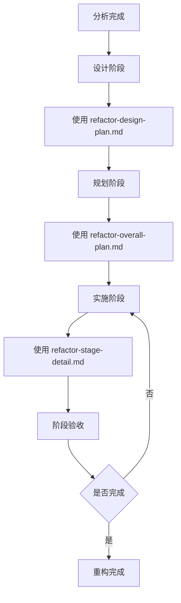

# � 重构模板使用指导

> **模板作用**: 提供重构相关模板的选择和使用指导  
> **目标用户**: 需要进行代码重构的开发团队  
> **更新时间**: 2025年7月22日

## 🎯 重构模板概览

### 📋 模板文件说明

| 模板文件 | 专注领域 | 主要用途 | 使用阶段 |
|---------|----------|----------|----------|
| `refactor-design-plan.md` | **技术设计** | 架构设计、接口定义、流程设计 | 重构设计阶段 |
| `refactor-overall-plan.md` | **总体规划** | 多阶段重构计划和实施策略 | 重构规划阶段 |
| `refactor-stage-detail.md` | **详细实施** | 具体任务分解和实施步骤 | 重构执行阶段 |

### � 重构流程和模板使用顺序



## � 详细使用指导

### 🏗️ 阶段1：重构设计（refactor-design-plan.md）

**使用时机**: 分析完成后，开始制定重构技术方案时

**核心内容**:
- **架构设计**: 新旧架构对比、模块设计、组件关系
- **接口设计**: 对外接口定义、内部接口、数据结构
- **流程设计**: 数据流程、处理流程、序列图
- **设计验证**: 设计质量评估、风险分析

**填写重点**:
1. **设计目标**: 明确架构改进目标，如降低耦合度、提高可维护性
2. **架构对比**: 用图表对比当前架构问题和新架构优势
3. **接口规范**: 详细定义接口参数、返回值、错误处理
4. **设计模式**: 选择合适的设计模式解决具体问题

**输出成果**: 完整的技术设计方案，为后续规划和实施提供依据

### 📅 阶段2：重构规划（refactor-overall-plan.md）

**使用时机**: 技术设计完成后，制定整体实施策略时

**核心内容**:
- **项目信息**: 重构范围、时间安排、人员分配
- **重构策略**: 渐进式vs大爆炸式、技术选择、风险控制
- **阶段规划**: 多阶段分解、里程碑设置、验收标准
- **资源管理**: 人力资源、技术资源、环境准备

**填写重点**:
1. **重构目标**: 具体可量化的目标，如代码行数、复杂度指标
2. **阶段分解**: 将大型重构分解为可管理的小阶段
3. **风险预案**: 识别关键风险点，制定应对和回滚策略
4. **验收标准**: 每个阶段的质量门禁和验收条件

**输出成果**: 完整的重构实施计划，包含时间表、资源安排、质量保证

### 🔧 阶段3：详细实施（refactor-stage-detail.md）

**使用时机**: 开始具体实施某个重构阶段时

**核心内容**:
- **任务分解**: 具体任务清单、函数实现、代码修改
- **实施步骤**: 详细操作步骤、代码示例、配置修改
- **质量控制**: 测试策略、代码审查、质量验证
- **进度管理**: 日常跟踪、里程碑检查、问题处理

**填写重点**:
1. **任务清单**: 详细到具体函数级别的实施任务
2. **操作步骤**: 可直接执行的命令和代码片段
3. **测试验证**: 每个功能的测试用例和验证方法
4. **风险应对**: 具体问题的处理流程和升级机制

**输出成果**: 可直接执行的实施指导，确保重构质量和进度

## 💡 模板使用最佳实践

### 🎯 设计阶段最佳实践

**架构设计建议**:
- 使用Mermaid图表清晰展示架构关系
- 对比分析要突出问题和改进点
- 接口设计要考虑向后兼容性
- 设计方案要有可行性验证

**常见设计模式应用**:
- **单一职责**: 每个模块只负责一个功能领域
- **依赖注入**: 降低模块间的直接依赖
- **工厂模式**: 统一对象创建和管理
- **观察者模式**: 实现模块间的松耦合通信

### 📊 规划阶段最佳实践

**阶段分解策略**:
- 每个阶段时间控制在2-4周
- 优先实施高价值、低风险的模块
- 保持每个阶段的功能完整性
- 设置明确的阶段验收标准

**风险控制要点**:
- 建立完整的代码备份机制
- 制定详细的回滚预案
- 设置质量门禁和强制检查点
- 准备应急响应团队和流程

### 🔧 实施阶段最佳实践

**代码实施建议**:
- 采用TDD（测试驱动开发）方式
- 每次提交都要通过完整测试
- 及时进行代码审查和质量检查
- 保持与设计方案的一致性

**质量保证措施**:
- 单元测试覆盖率>80%
- 集成测试验证模块协作
- 性能测试确保无退化
- 用户验收测试确保功能正确

## ⚠️ 常见问题和解决方案

### 问题1：设计过于复杂，实施困难

**解决方案**:
- 简化设计方案，采用渐进式改进
- 分解复杂设计为多个简单步骤
- 先实现核心功能，再完善辅助功能
- 及时调整设计以适应实施现实

### 问题2：重构过程中出现功能回归

**解决方案**:
- 建立完整的回归测试套件
- 每次修改后立即执行全量测试
- 采用特性开关控制新旧功能切换
- 准备快速回滚机制和流程

### 问题3：团队成员理解不一致

**解决方案**:
- 组织设计方案评审会议
- 建立详细的技术文档
- 进行代码实现培训和指导
- 建立定期沟通和同步机制

### 问题4：重构进度滞后

**解决方案**:
- 重新评估任务复杂度和时间估算
- 调整资源分配和人员安排
- 简化部分功能或延后非核心特性
- 寻求外部支持或临时资源

## 🔧 高级重构技巧

### 大型系统重构策略

**分层重构**:
1. **数据层**: 先重构数据结构和存储
2. **逻辑层**: 再重构业务逻辑和算法
3. **接口层**: 最后重构用户接口和API

**模块化重构**:
1. **核心模块**: 优先重构最重要的核心功能
2. **依赖模块**: 按依赖关系逐步重构
3. **辅助模块**: 最后重构工具和辅助功能

### 风险最小化技巧

**并行重构**:
- 新旧代码并行运行，逐步切换
- 使用特性开关控制功能启用
- 实施灰度发布和分批验证

**增量验证**:
- 每完成一个模块立即验证
- 建立持续集成和自动化测试
- 实施代码质量自动化检查

## 📚 相关资源

### 参考文档

- **主工作流**: `analysis_workflow_template.md` - 完整分析工作流
- **实施指导**: `guide-analysis-implementation.md` - 分析工作流使用指导
- **专项模板**: `specialist-*` 系列 - 专项分析模板

### 学习资源

- **重构理论**: Martin Fowler《重构：改善既有代码的设计》
- **设计模式**: GoF设计模式、企业应用架构模式
- **代码质量**: Clean Code、代码大全等经典书籍

### 工具推荐

- **代码分析**: SonarQube、CodeClimate
- **测试工具**: pytest、unittest、Mock框架
- **文档工具**: Mermaid、PlantUML、Sphinx

---

**开始重构**: 根据分析结果，按照"设计→规划→实施"的顺序使用对应模板！

**获取帮助**: 重构过程中遇到问题，可参考本指导的最佳实践和解决方案部分。
| `{{STAGE_OBJECTIVES}}` | 阶段目标 | "环境、控制器、仿真配置模块化" |
| `{{FUNCTION_TABLE_ROWS}}` | 函数清单表格行 | 详细的函数列表数据 |
| `{{IMPLEMENTATION_STEPS}}` | 实施步骤 | 分天的详细实施计划 |
| `{{BACKUP_FILE_LIST}}` | 备份文件命令列表 | `Copy-Item "simulation.py" "$backupDir/"` |
| `{{BACKUP_FILES_ARRAY}}` | 备份文件数组 | `"simulation.py", "config_manager.py"` |

## 🧪 测试强制要求

### 阶段门控制原则

每个重构阶段**必须满足以下测试要求**才能进入下一阶段：

1. **功能测试100%通过**: 所有原有功能完全正常
2. **性能测试达标**: 性能退化控制在5%以内  
3. **集成测试通过**: 模块间协作正常
4. **回归测试通过**: 与历史版本输出一致

### 测试验证流程

```
阶段N开发完成
    ↓
自测验证
    ↓
功能验证 (100%通过)
    ↓
性能验证 (退化<5%)
    ↓  
集成验证 (模块协作正常)
    ↓
用户验证 (真实场景测试)
    ↓
通过确认 → 进入阶段N+1
    ↓
失败 → 问题修复或回滚
```

## 📊 模板输出示例

### 总体重构计划输出文档

- `overall_refactoring_plan.md` - 总体重构策略和分阶段计划
- `phase1_detailed_plan.md` - 第一阶段详细实施计划  
- `refactoring_risk_assessment.md` - 重构风险评估
- `refactoring_testing_strategy.md` - 重构测试策略

### 详细阶段计划输出文档

- 完整的函数清单表格（包含优先级和依赖关系）
- 详细的实施步骤（按天分解）
- 风险管理和应对策略
- 预期收益评估

## 🔧 定制说明

### 模板变量替换

AI系统会根据实际分析结果自动替换模板中的变量：

1. **项目特定信息**: 基于代码分析结果自动提取
2. **技术栈信息**: 根据项目依赖和框架自动识别  
3. **复杂度数据**: 基于代码指标计算自动生成
4. **重构建议**: 基于分析发现自动制定

### 模板扩展

如需扩展模板功能：

1. 在模板文件中添加新的变量占位符
2. 在分析工作流中添加对应的数据收集逻辑
3. 更新本说明文档的变量表格

## 📝 最佳实践

### 重构计划制定原则

1. **代码安全**: 任何修改前必须先进行完整备份，确保可以快速回滚
2. **风险可控**: 每个阶段都要有明确的风险评估和回滚方案
3. **功能保护**: 任何时候都不能影响系统的核心功能
4. **渐进实施**: 小步快跑，避免大规模一次性重构
5. **测试优先**: 建立完善的测试体系确保重构安全性

### 代码备份最佳实践

#### 备份策略
- **备份时机**: 每个重构阶段开始前必须执行备份
- **备份范围**: 备份所有将要修改的源文件，包括测试文件
- **备份命名**: 使用时间戳和阶段标识，便于版本管理
- **备份验证**: 备份完成后必须验证文件完整性

#### 备份目录结构
```
backups/
├── backup_stage1_20250715_143022/    # 第一阶段备份
│   ├── simulation.py                 # 备份的源文件
│   ├── config_manager.py            # 其他相关文件
│   └── backup_metadata.json         # 备份元数据
├── backup_stage2_20250718_091534/    # 第二阶段备份
│   └── ...
└── backup_metadata.json             # 全局备份历史
```

#### 备份元数据
每次备份都会生成包含以下信息的元数据文件：
- 备份时间和阶段标识
- 备份文件列表和校验信息
- Git提交哈希值
- 重构目标和预期变更说明

### 模板使用建议

1. **强制备份**: 任何重构阶段开始前必须执行代码备份，这是不可跳过的步骤
2. **保持模板格式**: 不要随意修改模板的结构和标记
3. **验证备份**: 备份完成后必须验证文件完整性和元数据记录
4. **及时更新**: 根据实际使用经验持续优化模板内容
5. **文档同步**: 模板修改后及时更新相关文档
6. **版本管理**: 对模板文件进行版本控制，跟踪变更历史

### 安全重构流程

```powershell
# 标准重构安全流程
1. 执行代码备份 (强制步骤)
2. 验证备份完整性
3. 开始阶段性修改
4. 执行测试验证
5. 确认功能正常
6. 提交代码变更
7. 更新文档记录
```

---

**模板维护**: 这些模板会根据实际使用经验持续优化和更新，确保生成的重构计划更加准确和实用。
