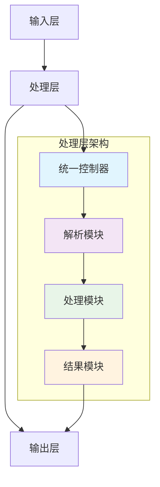
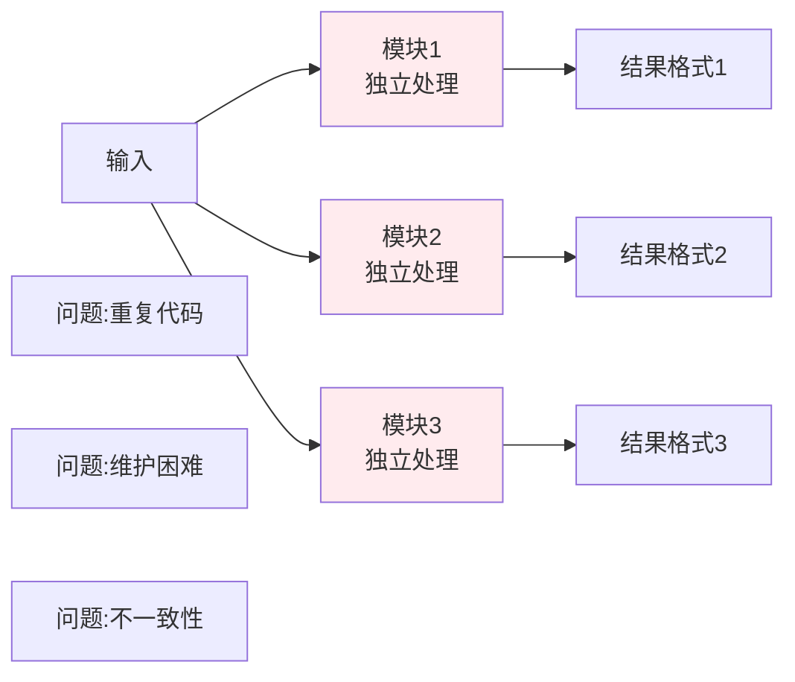
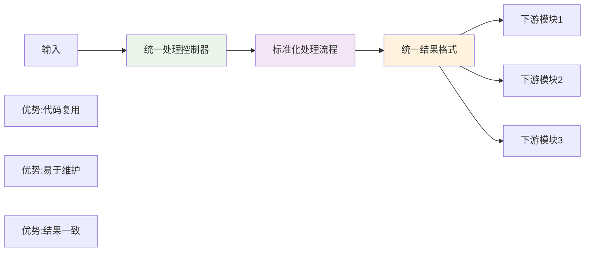
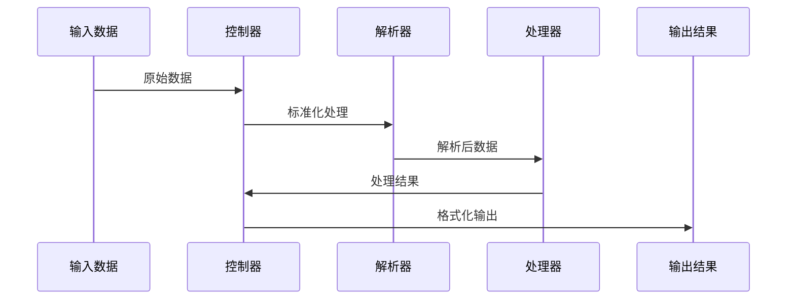

# 重构设计方案模板

> **专注领域**: 架构设计、接口定义、流程设计  
> **使用场景**: 制定重构的技术设计方案，不涉及具体实施细节

## 📋 设计基本信息

- **设计方案名称**: [重构设计方案名称]
- **设计日期**: [日期]
- **目标模块**: [模块名称]
- **设计原则**: [设计原则描述]
- **设计版本**: [版本号]

## 🎯 设计目标和原则

### 设计目标

基于现状分析，制定以下重构设计目标：

1. **架构目标** - [具体架构改进描述]
2. **接口目标** - [接口设计和标准化描述]
3. **性能目标** - [性能优化设计描述]
4. **可维护性目标** - [可维护性设计描述]

### 设计原则

**核心设计原则**:
- [原则1]: [具体说明]
- [原则2]: [具体说明]
- [原则3]: [具体说明]

**设计约束**:
- [约束1]: [具体限制]
- [约束2]: [具体限制]
- [约束3]: [具体限制]

## 🏗️ 架构设计

### 设计问题分析

**当前架构问题**:
- [问题1描述]: [影响和后果]
- [问题2描述]: [影响和后果] 
- [问题3描述]: [影响和后果]

**设计改进点**:
- [改进1描述]: [预期效果]
- [改进2描述]: [预期效果]
- [改进3描述]: [预期效果]

### 新架构设计

#### 整体架构设计



#### 模块设计详述

**核心模块1: [模块名称]**
- **职责**: [模块主要职责]
- **输入**: [输入接口定义]
- **输出**: [输出接口定义]
- **核心功能**: [核心处理逻辑]

**核心模块2: [模块名称]**
- **职责**: [模块主要职责]
- **输入**: [输入接口定义]
- **输出**: [输出接口定义]
- **核心功能**: [核心处理逻辑]

### 新旧架构对比

#### 当前架构问题分析


#### 新架构优势展示


## � 接口设计

### 对外接口设计

#### 核心接口1: [接口名称]

```python
def [interface_function_name](parameters):
    """
    接口功能: [功能描述]
    
    Args:
        param1 (type): [参数1描述]
        param2 (type): [参数2描述]
        
    Returns:
        result_type: [返回值描述]
        
    Raises:
        ExceptionType: [异常情况描述]
    """
    pass
```

**接口特性**:
- **输入规范**: [输入数据格式和要求]
- **输出规范**: [输出数据格式和标准]
- **错误处理**: [错误处理机制]
- **兼容性**: [向后兼容性说明]

#### 内部接口2: [接口名称]

```python
def [internal_interface_name](parameters):
    """
    内部接口功能: [功能描述]
    
    [接口设计说明]
    """
    pass
```

### 数据流设计

#### 数据处理流程



#### 数据结构设计

**核心数据结构1**:
```python
class [DataStructureName]:
    """
    数据结构说明: [用途和特点]
    """
    def __init__(self):
        self.field1: [type] = [default]  # [字段1说明]
        self.field2: [type] = [default]  # [字段2说明]
        self.field3: [type] = [default]  # [字段3说明]
```

**核心数据结构2**:
```python
class [AnotherStructureName]:
    """
    数据结构说明: [用途和特点]
    """
    def __init__(self):
        self.property1: [type] = [default]  # [属性1说明]
        self.property2: [type] = [default]  # [属性2说明]
```

## 📁 文件结构设计

### 模块文件组织

```
[project_root]/
├── [module_name]/                   # 核心模块目录
│   ├── __init__.py                  # 模块初始化
│   ├── [controller_file].py         # 控制器 - 主要协调逻辑
│   ├── [parser_file].py             # 解析器 - 数据解析处理
│   ├── [processor_file].py          # 处理器 - 核心业务逻辑
│   └── [interface_file].py          # 接口 - 对外接口定义
├── [config_dir]/                    # 配置文件目录
│   ├── [config_file_1].yaml         # [配置1描述]
│   └── [config_file_2].yaml         # [配置2描述]
└── [utils_dir]/                     # 工具模块目录
    ├── [utility_file_1].py          # [工具1描述]
    └── [utility_file_2].py          # [工具2描述]
```

### 文件职责定义

**[controller_file].py** - 控制器文件
- **职责**: 统一控制和协调各模块
- **核心类**: [ControllerClassName]
- **主要方法**: [主要方法列表]

**[parser_file].py** - 解析器文件
- **职责**: 数据解析和格式转换
- **核心类**: [ParserClassName]
- **主要方法**: [主要方法列表]

**[processor_file].py** - 处理器文件
- **职责**: 核心业务逻辑处理
- **核心类**: [ProcessorClassName]
- **主要方法**: [主要方法列表]

## 🎨 设计模式应用

### 使用的设计模式

**模式1: [设计模式名称]**
- **应用场景**: [在哪里使用]
- **设计原因**: [为什么使用此模式]
- **实现概述**: [如何实现]

**模式2: [设计模式名称]**
- **应用场景**: [在哪里使用]
- **设计原因**: [为什么使用此模式]
- **实现概述**: [如何实现]

### 模式示例代码

```python
# 设计模式实现示例
class [PatternClass]:
    """
    [设计模式名称] 实现示例
    """
    def [pattern_method](self):
        """
        模式核心方法
        """
        # [实现逻辑概述]
        pass
```

## 🔍 设计验证和评估

### 设计质量评估

**可维护性评估**:
- [评估指标1]: [预期改善]
- [评估指标2]: [预期改善]
- [评估指标3]: [预期改善]

**性能影响评估**:
- [性能指标1]: [预期影响]
- [性能指标2]: [预期影响]
- [性能指标3]: [预期影响]

**扩展性评估**:
- [扩展能力1]: [支持程度]
- [扩展能力2]: [支持程度]
- [扩展能力3]: [支持程度]

### 设计风险分析

**技术风险**:
- [风险1]: [风险描述] - [应对策略]
- [风险2]: [风险描述] - [应对策略]

**兼容性风险**:
- [兼容性问题1]: [影响评估] - [解决方案]
- [兼容性问题2]: [影响评估] - [解决方案]

## 📋 设计方案总结

### 设计核心特点

1. **[特点1]**: [具体说明和优势]
2. **[特点2]**: [具体说明和优势]
3. **[特点3]**: [具体说明和优势]

### 预期设计效果

**短期效果**:
- [效果1]: [具体指标]
- [效果2]: [具体指标]

**长期效果**:
- [效果1]: [具体指标]
- [效果2]: [具体指标]

### 后续设计完善

**设计优化方向**:
- [优化方向1]: [具体建议]
- [优化方向2]: [具体建议]

**设计扩展建议**:
- [扩展建议1]: [实施建议]
- [扩展建议2]: [实施建议]

---

**设计完成标志**: 
- ✅ 架构设计清晰且可行
- ✅ 接口定义完整且规范
- ✅ 数据流设计合理且高效
- ✅ 文件结构清晰且易维护
- ✅ 设计风险已识别且有应对方案

**下一步**: 基于此设计方案，使用 `refactor-stage-detail.md` 制定详细的实施计划

**职责**:
- [职责1描述]
- [职责2描述]
- [职责3描述]

**主要方法**:
```python
class [ComponentName]:
    def __init__(self, [parameters]):
        [初始化逻辑]
    
    def [method1](self, [params]) -> [return_type]:
        """[方法1功能描述]"""
        
    def [method2](self, [params]) -> [return_type]:
        """[方法2功能描述]"""
        
    def [method3](self, [params]) -> [return_type]:
        """[方法3功能描述]"""
```

#### 2. [配置管理/辅助组件]

**在现有 `[配置文件路径]` 中添加方法**：

```python
def [new_method](self, [parameter]: str) -> Dict[str, Any]:
    """
    [方法功能描述] (参考[现有方法]方法)
    Args:
        [parameter]: [参数描述]
    Returns:
        [返回值描述]
    """
    return self.get_config_file(f"[config_path_template]")
```

### [核心逻辑]设计

**参考来源**: `[源文件路径]` 的 `[参考方法]` 方法

```python
def [core_method](self, data: [input_type], [other_params]) -> [return_type]:
    """
    [核心逻辑描述] (参考[源文件]第[行号]行)
    """
    try:
        # [步骤1描述]
        [code_logic_1]
        
        if [condition]:
            # [步骤2描述]
            [code_logic_2]
            return [result_type_1]
        else:
            # [步骤3描述]  
            [code_logic_3]
            return [result_type_2]
    except Exception as e:
        [error_handling]
        return [error_result]

def [processing_method](self, data: [input_type], config: dict) -> dict:
    """
    [处理逻辑描述] (参考[源文件]第[行号]行)
    
    支持：
    1. [功能1描述]
    2. [功能2描述] - [特殊情况说明]
    """
    [initialization_code]
    
    for [item] in config["[config_section]"]:
        if [item]["[property]"] > 0:
            # [固定处理逻辑]
            [fixed_processing_code]
        else:
            # [动态处理逻辑] (参考第[行号]行)
            [dynamic_processing_code]
    
    return [processed_result]
```

## 📁 文件组织结构

### 新建文件和配置

```
[project_root]/
├── [new_directory]/                 # 新建：[目录用途描述]
│   ├── [config_file_1]              # [配置文件1描述]
│   ├── [config_file_2]              # [配置文件2描述]
│   └── ...                          # [其他配置文件]

[module_directory]/
└── [main_file]                      # 重构：[主要文件描述]

[other_directory]/
└── [support_file]                   # 扩展：[辅助文件描述]
```

### 重构影响范围

**需要修改的文件**:
1. `[file_path_1]` - [修改内容描述]
2. `[file_path_2]` - [修改内容描述]
3. `[file_path_3]` - [修改内容描述]
4. `[file_path_4]` - [修改内容描述]

**新建的文件**:
1. `[new_file_path_1]` - [新文件用途描述]
2. `[new_file_path_2]` - [新文件用途描述]

## 🚀 实施计划

### 阶段1：[阶段名称] (优先级：高)

**目标**: [阶段目标描述]

**任务清单**:
1. [任务1描述]
2. [任务2描述]
3. [任务3描述]
4. [任务4描述]

**参考源码**:
- [参考类型1]: `[参考文件路径]`
- [参考类型2]: `[参考方法]` 第[行号]行
- [参考类型3]: `[参考配置]`
- [参考类型4]: `[参考模式]` 方法

**预期时间**: [X-Y]天
**风险评估**: [风险等级] - [风险描述]

### 阶段2：[阶段名称] (优先级：高)

**目标**: [阶段目标描述]

**任务清单**:
1. [任务1描述]
2. [任务2描述]
3. [任务3描述]
4. [任务4描述]

**预期时间**: [X]天
**风险评估**: [风险等级] - [风险描述]

### 阶段3：[阶段名称] (优先级：中，可选)

**目标**: [阶段目标描述]

**任务清单**:
1. [任务1描述] (可选)
2. [任务2描述] (可选)
3. [任务3描述] (可选)

**预期时间**: [X-Y]天每个模块
**风险评估**: [风险等级] - [风险描述]

## 🎯 重构优势

### 短期收益
- **[收益类型1]**: [具体描述和数据]
- **[收益类型2]**: [具体描述和数据]
- **[收益类型3]**: [具体描述和数据]

### 长期收益
- **[长期收益1]**: [具体描述和数据]
- **[长期收益2]**: [具体描述和数据]
- **[长期收益3]**: [具体描述和数据]

## 📋 风险评估

### 主要风险
1. **[风险类型1]** - [风险描述]
2. **[风险类型2]** - [风险描述]
3. **[风险类型3]** - [风险描述]

### 风险缓解策略
1. **[缓解策略1]** - [具体措施]
2. **[缓解策略2]** - [具体措施]
3. **[缓解策略3]** - [具体措施]
4. **[缓解策略4]** - [具体措施]

## 📈 成功评价标准

1. **[标准1]**: [具体指标]
2. **[标准2]**: [具体指标]
3. **[标准3]**: [具体指标]
4. **[标准4]**: [具体指标]
5. **[标准5]**: [具体指标]

## 🔧 技术实现细节

### [核心功能]策略
```python
def [implementation_method](self, [params]) -> [return_type]:
    """[功能描述]"""
    if [condition_check]:
        # [处理逻辑1说明]
        if [specific_condition]:
            return '[result_1]'
        # [处理逻辑2说明]
        elif [other_condition]:
            return '[result_2]'
    return '[default_result]'
```

### [辅助功能]策略
```python
class [HelperClass](Exception):
    """[类功能描述]"""
    def __init__(self, message: str, [other_params] = None):
        self.message = message
        self.[other_attribute] = [other_params]
        super().__init__(message)
```

### [配置管理]
```python
class [ConfigClass]:
    """[配置管理描述]"""
    DEFAULT_CONFIG = {
        '[config_key_1]': [default_value_1],
        '[config_key_2]': [default_value_2],
        '[config_key_3]': [default_value_3],  # [单位或说明]
        '[config_key_4]': [default_value_4]   # [单位或说明]
    }
```

通过这个设计方案，我们可以在保持功能完整性的前提下，显著提升[系统特性1]、[系统特性2]和[系统特性3]。设计重点放在实用性上，避免过度工程化，确保方案的可操作性。

---

## 📚 参考来源说明

本设计方案基于以下用户提供的参考信息：

### 🔍 用户指导的参考源码
- **[参考源码1描述]**: `[文件路径]`的`[方法名]`方法 - [用途说明]
- **[参考源码2描述]**: `[文件路径]`第[行号]-[行号]行 - [用途说明]  
- **[参考配置描述]**: `[配置文件路径]` - [用途说明]
- **[参考模式描述]**: `[文件路径]`的`[方法名]`方法 - [用途说明]

### 🎯 用户反馈的设计调整
- **简化设计**: 用户指出原方案过于复杂，建议采用[简化方案描述]
- **复用现有**: 用户建议复用现有的[组件名称]而非重新实现
- **配置驱动**: 用户推荐使用配置文件驱动的模式，参考[配置系统]
- **去除冗余**: 用户明确不需要[不需要的组件类型]，保持设计简洁

### 📋 用户需求澄清
- **核心目标**: [用户明确的核心需求]
- **技术约束**: [用户提到的技术限制]
- **实施偏好**: [用户偏好的实施方式]
- **风险容忍**: [用户对风险的接受程度]

> **注意**: 本方案严格按照用户的反馈和指导进行设计，确保符合实际项目需求和技术环境。所有参考的源码和配置都经过用户确认，保证了方案的可行性和实用性。
