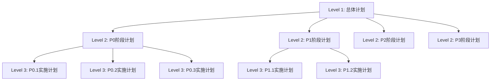
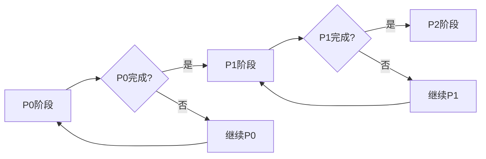
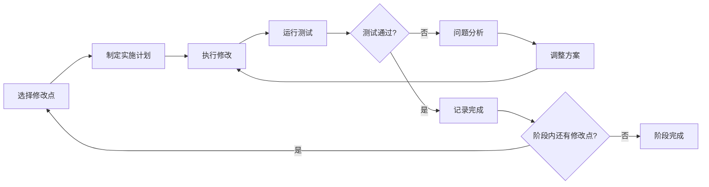

# 重构工作流详细指南 | Refactor Workflow Detailed Guide

> 🌍 **Language Version | 语言版本**: [English Version](README_en.md) | [返回主页](../README.md)

## 📋 目录

- [概述](#概述)
- [工作流特点](#工作流特点)
- [使用方法](#使用方法)
- [三层级计划体系](#三层级计划体系)
- [双层循环执行](#双层循环执行)
- [目录结构说明](#目录结构说明)
- [环境设置](#环境设置)
- [模板使用](#模板使用)
- [最佳实践](#最佳实践)
- [常见问题](#常见问题)

## 概述

重构工作流是一个基于GitHub Copilot的系统化重构解决方案，专为AI辅助模块级代码重构设计。它提供了结构化的重构方法，确保模块级重构过程的可控性和高质量交付。

这是我们首个支持Mermaid图表的工作流，参考了《MermaidFlow: Redefining Agentic Workflow Generation via Safety-Constrained Evolutionary Programming》的思路，通过可视化图表增强工作流的理解和执行效率。

### 核心模板

- **主模板**: `refactor_system/refactor_workflow_template.md`
- **支持文件**: `refactor_system/` 目录下的所有模板和工具

## 工作流特点

### 🎯 系统化重构流程

- **双层循环控制**: 阶段级外循环 + 修改点级内循环
- **三层级计划**: 总体计划 → 阶段计划 → 实施计划
- **优先级驱动**: P0/P1/P2/P3 优先级阶段管理

### 🤖 AI协作优化

- **Copilot集成**: 专为GitHub Copilot Agent模式优化
- **智能检查点**: 自动验证和质量保证
- **增量式修改**: 降低风险，提高成功率

### 📊 可视化支持

- **Mermaid图表**: 支持流程图、架构图和依赖关系可视化
- **进度跟踪**: 图形化展示重构进度和状态
- **架构演进**: 可视化展示模块重构前后的架构变化

## 使用方法

### 启动重构工作流

```markdown
我需要对 [模块名] 进行重构，请启动重构工作流。
```

### 工作流步骤

1. **需求分析**: 确定重构范围和目标
2. **计划制定**: 创建三层级重构计划
3. **分阶段执行**: 按优先级逐步实施
4. **质量保证**: 每个修改点的验证和测试
5. **文档维护**: 同步更新相关文档

## 三层级计划体系

### 🎯 Level 1: 总体计划

**目标**: 定义整体重构策略和优先级框架

- **内容**: 重构愿景、P0-P3优先级划分、风险评估
- **输出**: `level1_overall.md`

### 📋 Level 2: 阶段详细计划

**目标**: 将总体计划分解为可执行的阶段任务

- **内容**: 具体修改点清单、检查点设置、实施顺序
- **输出**: `level2_phase_P0.md`, `level2_phase_P1.md`...

### 🔧 Level 3: 实施计划

**目标**: 函数级别的具体实施方案

- **内容**: 代码修改方案、测试用例、质量标准
- **输出**: `level3_impl_P0.1.md`, `level3_impl_P0.2.md`...

### 计划层级关系



## 双层循环执行

### 🔄 外循环: 阶段控制



**特点**:

1. **优先级驱动**: P0 → P1 → P2 → P3 按序执行
2. **阶段完整性**: 每个阶段必须100%完成才能进入下一阶段
3. **用户参与决策**: 每个阶段结束需要用户确认

### 🔁 内循环: 修改点处理



**特点**:

1. **增量修改**: 每次只处理一个修改点
2. **即时验证**: 每个修改点完成后立即测试
3. **失败恢复**: 失败后分析问题并调整方案

### 🔄 执行控制最佳实践

1. **小批量渐进**
   - 每次只处理少量修改点
   - 完成一个修改点再进行下一个
   - 避免大范围同时修改

2. **即时验证**
   - 每个修改点完成后立即测试
   - 运行相关单元测试和集成测试
   - 确保功能正确性和性能指标

3. **文档同步更新**
   - 实时更新实施记录和进度
   - 记录遇到的问题和解决方案
   - 维护计划变更的版本历史

## 目录结构说明

```text
refactor_system/
├── refactor_workflow_template.md    # 主工作流模板
├── README.md                       # 详细说明(中文)
├── README_en.md                    # 详细说明(英文)
├── docs/                          # 文档目录
│   ├── architecture/              # 架构设计文档
│   ├── best-practices/            # 最佳实践指南
│   └── examples/                  # 使用示例
├── templates/                     # 模板文件
│   ├── level1-overall.md          # Level 1 总体计划模板
│   ├── level2-phase.md           # Level 2 阶段计划模板
│   ├── level3-implementation.md   # Level 3 实施计划模板
│   ├── progress-tracking.md       # 进度跟踪模板
│   ├── quality-checklist.md      # 质量检查清单
│   └── mermaid-diagrams.md       # Mermaid图表模板
├── tools/                        # 工具脚本
│   ├── refactor-validator.py     # 重构验证工具
│   ├── progress-tracker.py       # 进度跟踪工具
│   ├── mermaid-generator.py      # Mermaid图表生成器
│   └── test-runner.ps1          # 测试运行脚本
└── case-studies/                 # 案例研究
    ├── successful-refactors/     # 成功重构案例
    └── lessons-learned/          # 经验教训总结
```

### 特色功能

- **Mermaid图表支持**: 首个集成Mermaid可视化的工作流系统
- **三层级计划**: 从战略到战术的完整计划体系
- **双循环执行**: 外循环控制阶段，内循环处理修改点
- **智能模板**: 基于最佳实践设计的模板系统

## 环境设置

### 必需工具

- **GitHub Copilot**: Agent模式支持
- **IDE**: VS Code 推荐，支持Mermaid预览
- **Git**: 版本控制和分支管理
- **测试框架**: 根据项目语言选择

### 可选工具

- **Mermaid CLI**: 用于生成图表图片
- **静态分析工具**: 代码质量检查
- **文档生成器**: 自动生成文档

## 模板使用

### 主模板

使用 `refactor_workflow_template.md` 作为重构会话的起点：

1. 复制模板到工作目录
2. 根据具体项目调整配置
3. 启动重构会话

### 计划模板

根据计划层级选择相应模板：

- **Level 1**: `templates/level1-overall.md`
- **Level 2**: `templates/level2-phase.md`
- **Level 3**: `templates/level3-implementation.md`

### Mermaid图表模板

使用 `templates/mermaid-diagrams.md` 创建可视化图表：

- 流程图模板
- 架构图模板
- 时序图模板
- 状态图模板

## 最佳实践

### 重构前准备

1. **代码备份**: 创建专用分支
2. **测试基线**: 确保现有测试通过
3. **依赖分析**: 理解模块间依赖关系
4. **风险评估**: 识别高风险修改点

### 执行过程

1. **小步快跑**: 每次修改范围最小化
2. **频繁测试**: 每个修改点完成后立即验证
3. **文档同步**: 实时更新设计文档
4. **进度跟踪**: 使用可视化工具监控进度

### 质量保证

1. **代码审查**: 每个修改点的人工审查
2. **自动化测试**: 单元测试和集成测试
3. **性能基准**: 确保性能不降级
4. **向后兼容**: 保持API兼容性

## 常见问题

### Q: 如何处理重构过程中的意外问题？

A: 重构工作流提供了完善的错误处理机制：

- 每个修改点都有回滚方案
- 问题发生时暂停执行，分析原因
- 调整实施计划后继续执行
- 记录问题和解决方案供后续参考

## 版本信息

- **当前版本**: 2.4.0
- **更新日期**: 2025年7月29日
- **兼容性**: GitHub Copilot Agent模式

---
**维护团队**: GitHub Copilot 工作流项目组
**许可证**: MIT License
