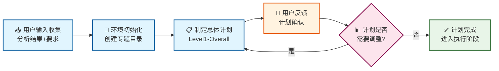
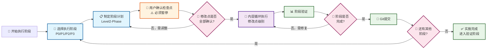
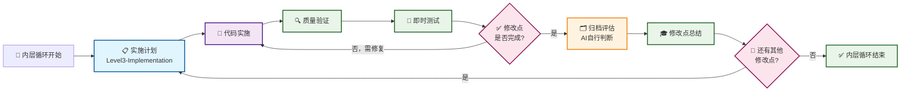
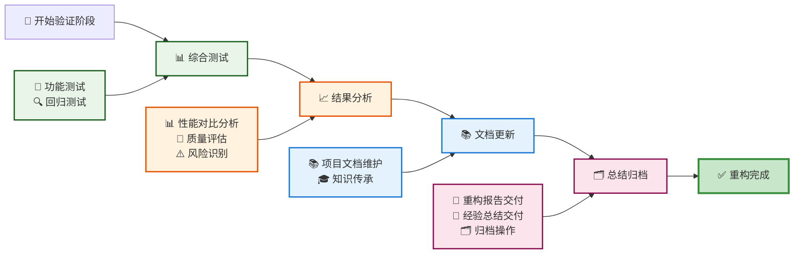
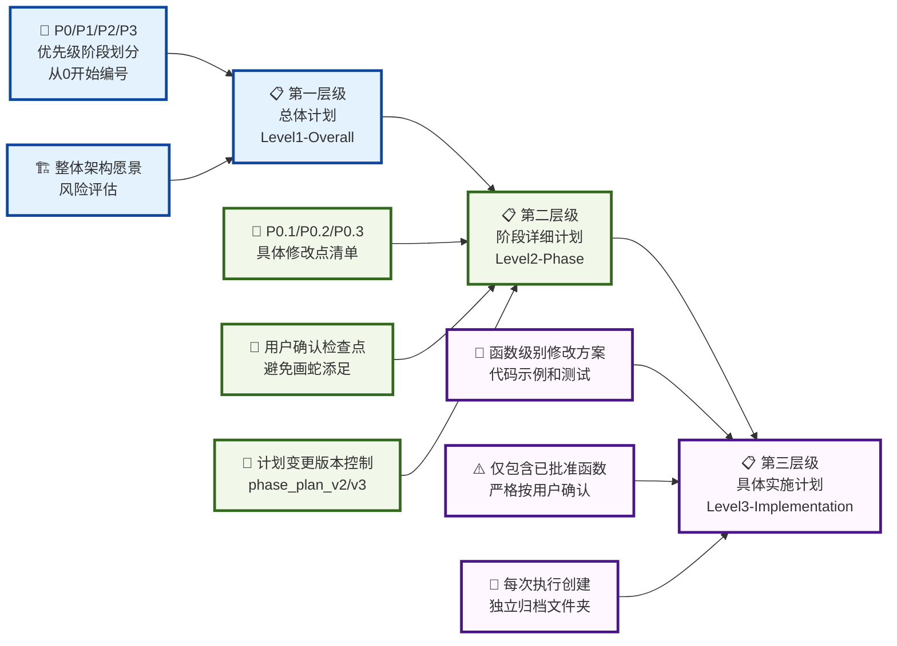

# 🔧 重构工作流 Mermaid 可视化模板

> **用途**: 将重构工作流程可视化，提供图表化的流程指南和详细的步骤分解

## 📑 目录结构

1. [🎯 一、总体流程 Mermaid 图表](#-一总体流程-mermaid-图表)
   - 1.1 [阶段一：重构规划流程图](#-11-阶段一重构规划流程图)
   - 1.2 [阶段二：外层循环（阶段级别）](#-12-阶段二外层循环阶段级别)
   - 1.3 [阶段二：内层循环（修改点级别）](#-13-阶段二内层循环修改点级别)
   - 1.4 [阶段三：验证总结流程图](#-14-阶段三验证总结流程图)
2. [🔄 二、双层级循环流程图](#-二双层级循环流程图)
   - 2.1 [三层级计划系统图](#-21-三层级计划系统图)
3. [📋 三、详细步骤分解](#-三详细步骤分解)
4. [🗂️ 四、流程资产管理规范](#️-四流程资产管理规范)
5. [🏗️ 五、核心方法论和标准](#️-五核心方法论和标准)

## 🤖 自动生成区域

> **说明**: 任务专用文档中，AI将自动填充以下内容

> **⚠️ 重要提示**: AI撰写文档时，务必保持简洁，突出关键信息，减少无用描述。

### 📝 任务信息

- **项目**: [自动识别项目类型和技术栈]
- **输入来源**: [代码分析工作流的输出目录]
- **重构目标**: [基于分析结果确定的重构目标]
- **技术环境**: [技术栈和依赖关系]

---

## 🎯 一、总体流程 Mermaid 图表

### 📊 1.1 阶段一：重构规划流程图



### 📊 1.2 阶段二：外层循环（阶段级别）



### 📊 1.3 阶段二：内层循环（修改点级别）



### 📊 1.4 阶段三：验证总结流程图



---

## 🔄 二、双层级循环流程图

### 📊 2.1 三层级计划系统图



---

## 📋 三、详细步骤分解

### 🎯 3.1 阶段一：重构规划（计划）

#### 步骤 1.1：用户输入收集和初步分析

- **输入**：📂 分析结果来源、🎯 重构要求、⚠️ 约束条件

  - 分析总结报告 (`final_analysis_report.md`)
  - 重构建议文档 (`improvement_roadmap.md`)
  - 技术指标数据 (`metrics/`, `reports/`)
  - 重构优先级和重点关注领域
  - 预期的改进效果和成功标准
  - 时间约束和资源限制
  - 不能变更的模块或接口
  - 必须保持的功能特性
  - 性能和兼容性要求
- **活动**：🔍 解析分析总结报告和重构建议、📊 提取技术指标和性能基准、⚠️ 识别关键风险点和技术债务、📝 理解用户要求和约束条件的具体含义
- **输出**：📋 用户输入信息的临时记录（内存中）、🔍 初步分析结果和处理计划（临时）、🚀 环境初始化准备信息

#### 步骤 1.2：环境初始化和输入处理

- **输入**：📋 用户输入信息的临时记录、🔍 初步分析结果和处理计划
- **活动**：

  - 🏗️ 在 `workflow/refactor_system/tasks/` 下创建专题重构文件夹
  - 📁 建立标准化目录结构
  - 🔧 设置版本控制和备份机制
  - 🛠️ 准备工具和验证环境
  - 📥 将分析工作流输出文档复制到 `master_plan/analysis_input/` 目录
  - 📝 创建 `master_plan/user_requirements.md` 记录用户额外要求
  - 📊 生成环境初始化报告
- **输出**：📁 专题文件夹：`workflow/refactor_system/tasks/refactor_项目名_YYYYMMDD/`、📂 `master_plan/analysis_input/` 下的所有输入文档、📝 `master_plan/user_requirements.md` 用户要求记录、📊 环境初始化和设置报告
- **规则**：📋 遵循目录结构标准 (参见 4.1节目录结构标准)

  - 专题文件夹命名：`refactor_项目名_YYYYMMDD`
  - 必须创建三大主目录：master_plan、P0-PN、final_validation
  - 阶段编号从0开始，修改点编号从1开始

#### 步骤 1.3：制定总体重构计划

- **输入**：📁 专题文件夹环境、📂 整理好的分析结果、📝 用户要求记录
- **活动**：

  - 🎯 基于分析结果确定重构目标
  - 🧩 识别可独立重构的模块
  - 📋 设计阶段划分策略
  - ⚠️ 制定风险缓解措施
  - 📊 使用模块对比分析（当用户提供参考模块时）
  - ✅ 评估技术可行性
  - 📊 预估工作量和时间
  - 🔗 识别关键依赖关系
  - 💾 制定备份策略
- **输出**：📋 `master_plan/master_refactor_plan.md` - 总体重构计划
- **模板**：📋 **必须使用**：`templates/level1-overall-plan-template.md`、📊 **模块对比分析模板**：`templates/module-comparison-analysis-template.md`
- **注意**：

  - 🔍 识别可直接复用的方法和组件
  - 🎯 确定需要适配的业务逻辑
  - 🏗️ 评估公共组件提取的可能性
  - 📝 确定优先级阶段划分（P0/P1/P2/P3等）
- **规则**：📋 遵循三层级计划规范 (参见 5.3节三层级计划系统)

  - 阶段编号从0开始 (P0/P1/P2/P3)
  - 必须包含风险评估和资源评估
  - 优先级划分需明确可执行性

#### 步骤 1.4：用户反馈和计划完善

**用户交互**

- 📊 向用户展示总体重构计划
- 💬 解释各阶段的目标和收益
- 📝 收集用户的修改意见和疑问
- 🎯 了解用户的优先级偏好

**计划迭代**

- 📝 根据用户反馈调整计划内容
- 📋 更新阶段划分和实施策略
- ⚠️ 重新评估风险和工作量
- ✅ 完善计划的可行性和合理性

**输出更新**

- 📋 更新 `master_plan/master_refactor_plan.md` - 完善后的总体重构计划
- 📝 **创建任务专用文档**：复制 `refactor_workflow_template.md` 为 `refactor_workflow_项目名.md`，并填充自动生成区域
- ✅ 计划已准备好进入执行阶段的详细规划
- 💾 执行一次git提交以方便后续回滚

**AI必须执行以下操作**：

```powershell
cd refactor_system
Copy-Item "refactor_workflow_template.md" "refactor_workflow_项目名.md"
```

- **首先进入refactor_system目录**：确保在工作流模板文档所在的正确目录
- 为当前重构任务创建专用的工作流文档
- 文档名应反映具体的重构项目（如：refactor_workflow_anc_host_架构重构.md）
- **更新自动生成区域**：在任务专用文档中填充具体的任务信息
- 暂停执行，提示用户切换到专用工作流文档再继续

### 🔄 3.2 阶段二：分阶段实施（执行）

#### 外层循环：阶段级别执行

##### O.1 阶段选择

- **输入**：📋 第一层级总体计划
- **输出**：✅ 确定的执行阶段
- **活动**：🎯 用户选择下一个要执行的优先级阶段（P0、P1、P2、P3等）
- **决策**：📊 基于当前进度和用户优先级确定

##### O.2 阶段计划制定

- **输入**：🎯 选定的阶段和总体计划
- **输出**：📝 阶段详细计划文档（包含完整的新增函数列表）
- **活动**：📋 制定第二层级单阶段详细计划，分解为具体修改点和新增函数清单
- **模板**：`templates/level2-phase-detailed-plan-template.md`
- **注意**：📋 列出所有可能的新增函数，标注必要性评估
- **规则**：📋 遵循阶段计划规范 (参见 4.2节文档命名规范)
  - 首次计划使用 `P[X]_plan.md` (如`P0_plan.md`)
  - 计划变更必须创建新版本 `P[X]_plan_v2.md`
  - 所有计划存放在 `P[X]_阶段主题/planning/` 目录

##### O.3 用户确认检查点（⚠️ 必须暂停等待）

- **输入**：📋 阶段详细计划（包含新增函数清单）
- **输出**：✅ 确认的修改点清单和已批准的新增函数列表
- **活动**：🤝 用户逐个审核并确认哪些修改点和新增函数需要实施，哪些暂缓或取消
- **注意**：⚠️ **AI必须在此步骤暂停，等待用户手动确认后才能继续**
- **价值**：🚫 避免AI过度设计，防止代码膨胀，确保只实施必要的修改

##### O.4 内层循环执行

- **输入**：✅ 确认的修改点清单
- **输出**：📊 各修改点的实施结果
- **活动**：🔄 针对每个确认的修改点执行内层循环
- **注意**：⚡ 可串行或并行执行多个修改点

##### O.5 阶段验证

- **输入**：📊 所有修改点的实施结果
- **输出**：📋 阶段完成报告
- **活动**：✅ 阶段级别的整体验证和质量检查
- **规则**：🎯 遵循验证标准 - 功能完整性、性能影响、代码质量

##### O.6 阶段总结

- **输入**：📋 阶段完成报告
- **输出**：📝 阶段经验总结文档
- **活动**：🎓 总结经验教训，更新知识库
- **模板**：`templates/refactor-lessons-learned-template.md`
- **决策**：🔄 继续下一阶段/修复问题/调整计划

##### O.7 Git提交和版本控制

- **输入**：💾 阶段完成的所有代码变更和文档
- **输出**：🏷️ Git提交记录和版本标签
- **活动**：📝 执行分阶段Git提交，确保修改有迹可循
- **价值**：🔄 便于后续恢复和问题追踪
- **规则**：📋 遵循Git提交规范 (参见 4.3节版本控制策略)
  - 提交消息格式：`refactor: 完成{阶段编号}_{阶段主题} - {主要改进点}`
  - 创建阶段标签：`refactor-{阶段编号}-completed`
  - 创建阶段标签：`refactor-{阶段编号}-completed`

#### 内层循环：修改点级别执行

##### I.1 实施计划制定

- **输入**：📋 单个修改点描述和已批准的新增函数清单
- **活动**：📝 制定第三层级具体实施计划，精细到函数级别，**仅包含用户已批准的函数**
- **输出**：📋 具体实施计划文档
- **必须使用模板**：`templates/level3-implementation-plan-template.md`
- **约束**：⚠️ 严格按照用户批准的函数清单，不得自行添加未批准的函数
- **规则**：📋 遵循实施计划规范 (参见 4.2节文档命名规范)
  - 单个修改点：`P[X].[Y]_<修改点描述>.md` (如`P0.1_权重加载优化.md`)
  - 多步骤组合：`P[X].[Y]_STEP_<范围>.md` (如`P0.2_STEP_1_2_3.md`)
  - 单个STEP：`P[X].[Y]_STEP[N].md` (如`P1.3_STEP4.md`)
  - 计划版本：添加`_v2`, `_v3`等后缀
  - 存放位置：`P[X]_阶段主题/planning/`目录
  - 执行归档：创建对应的`P[X].[Y]_修改点主题/`目录用于实际执行

##### I.2 代码实施

- **输入**：📋 具体实施计划
- **输出**：💻 变更的代码
- **活动**：🔧 按照函数级别方案进行代码迁移和重构
- **规则**：📈 遵循渐进式原则 - 先备份、保持功能完整性
- **注意**：📝 详细记录所有变更和决策
- **代码备份规则**：📁 执行以下代码备份策略
  - **备份时机**：开始修改任何代码文件之前必须创建备份
  - **备份策略选择**：
    - **少量文件（<3个）**：使用原地文件备份
      - **备份命名**：`<原文件名>_backup_<YYYYMMDD_HHMM>.py` (如：`anc_algorithm_backup_20250729_1430.py`)
      - **备份位置**：在相同目录下创建备份文件，或创建`backup/`子目录存放
    - **多个文件（>=3个）**：使用Git提交备份
      - **Git备份**：执行 `git add .` 然后 `git commit -m "重构前备份-<修改点描述>-<YYYYMMDD_HHMM>"`
      - **标签创建**：可选择性创建标签 `git tag backup-<修改点>-<YYYYMMDD_HHMM>`
  - **验证备份**：确认备份完成后再开始修改原文件
    - 文件备份：确认备份文件存在且大小正确
    - Git备份：确认提交记录存在且包含所有需要的文件

##### I.3 质量验证

- **输入**：💻 变更的代码
- **输出**：📊 质量报告
- **活动**：🔍 代码质量检查和基本功能验证
- **规则**：📋 遵循质量保证原则 (参见 5.1节重构核心原则)
  - 不能影响核心功能
  - 不允许显著性能退化
  - 必须通过基本功能验证
  - 质量阈值不低于原有标准
- **注意**：⚠️ 发现问题立即记录，决定继续或暂停

##### I.4 即时测试（可选）

- **输入**：💻 变更的代码和质量报告
- **输出**：📋 测试结果
- **活动**：🧪 单元测试、集成测试或手动验证
- **规则**：✅ 相关测试必须通过
- **注意**：🤝 部分场景可能需要用户手动验证

##### I.5 修改点评估

- **输入**：📊 质量报告和测试结果
- **输出**：📋 修改点完成报告
- **活动**：📈 评估修改点完成情况和质量
- **决策**：✅ 通过/修复/回滚
- **价值**：📊 为阶段级验证提供输入

##### I.6 修改点总结

- **输入**：📋 修改点完成报告
- **活动**：🎓 记录实施经验和遇到的问题
- **归档评估**：🗂️ AI自行评估是否需要归档本次修改的文件（通常单个内层循环会修改多个文件，实时归档避免后期整理困难）
- **归档活动**：📁 如需归档，将相关代码文件、配置文件、测试文件等复制到当前阶段的相应子文件夹中
- **输出**：📝 修改点经验记录
- **价值**：💡 指导后续修改点的实施
- **规则**：📋 遵循经验总结规范 (参见 4.2节文档命名规范)
  - 使用模板：`templates/refactor-lessons-learned-template.md`
  - 文档命名：`lessons_learned_[阶段]_[日期].md`
  - 必须记录问题解决方案和工具推荐

### 📊 3.3 阶段三：验证总结（验证）

#### 步骤 3.1：综合测试

**功能测试**

- 🧪 执行完整功能测试套件（如有）
- 🔗 进行端到端集成测试
- 🤝 请求用户手动测试关键功能
- ✅ 验证所有重构模块正常工作

##### 回归测试

- 🔍 验证未修改模块功能完整性
- 🔌 检查接口兼容性
- 📊 确认数据处理正确性
- ⚠️ 测试异常情况处理

#### 步骤 3.2：结果分析

##### 性能对比分析

- 📊 对比重构前后性能指标
- 📈 分析性能变化趋势
- 🔍 识别性能改进点和潜在问题
- ✅ 验证性能目标达成情况

##### 质量评估

- 📊 代码质量指标对比（复杂度、可读性等）
- 🏗️ 架构改进效果评估
- 💰 技术债务清理情况分析
- 🔧 维护成本变化评估

##### 风险识别

- ⚠️ 识别潜在的稳定性风险
- 🔧 分析未来维护难点
- 📈 评估扩展性限制
- 🛡️ 制定风险缓解措施

#### 步骤 3.3：文档更新和知识传承

##### 项目文档维护

- 📚 更新技术文档和架构说明
- 📖 完善用户手册和操作指南
- 📄 更新API文档和接口说明
- 📝 维护变更记录和版本历史

##### 知识传承

- 📚 **阅读历史经验文档**：回顾项目历史中所有阶段的重构经验总结文档
- 📊 **经验汇总**：综合本次重构和历史经验，提取共性模式和最佳实践
- 📝 **编写知识文档**：整理重构方法论、经验教训和实施建议
- 💡 **建立知识库**：为后续重构项目建立可复用的知识资产

#### 步骤 3.4：总结归档

##### 重构报告交付

- **必须使用模板**：`templates/delivery-template.md`
- **内容要求**：📊 包含重构目标达成情况、技术改进效果、风险评估等

##### 经验总结交付

- **必须使用模板**：`templates/refactor-lessons-learned-template.md`
- **内容要求**：🎓 记录关键经验、问题解决方案、工具推荐和下阶段建议

##### 归档操作

- 📂 **复制工作流文档到专题目录**：将任务专用工作流文档复制到 `master_plan/` 目录
- 🗂️ **创建completed_refactors目录**：在 `tasks/` 目录下创建 `completed_refactors/` 存档目录
- 📁 **移动专题目录到存档**：将整个专题目录移动到 `completed_refactors/` 进行集中存档
- 📋 **更新INDEX.md**：更新 `tasks/INDEX.md` 记录重构完成状态和关键成果
- **规则**：📋 遵循归档标准 (参见 4.1节目录结构标准)
  - 所有第三层级执行必须创建独立文件夹归档
  - 计划变更必须保留版本历史
  - 归档后更新全局索引记录

---

## 🗂️ 四、流程资产管理规范

### 📁 4.1 目录结构标准

```
refactor_system/
├── refactor_workflow_template.md          # 本文档 - 重构可视化工作流
├── README.md                              # 系统说明文档
├── refactor_workflow_项目名.md             # 任务专用文档
├── templates/                            # 模板文件集合
│   ├── level1-overall-plan-template.md           # 【第一层级】总体重构计划模板
│   ├── level2-phase-detailed-plan-template.md    # 【第二层级】单阶段详细计划模板
│   ├── level3-implementation-plan-template.md    # 【第三层级】具体实施计划模板
│   ├── module-comparison-analysis-template.md    # 【模块对比分析】参考模块对比分析模板
│   ├── refactor-lessons-learned-template.md      # 重构经验总结模板
│   ├── delivery-template.md                      # 交付模板
│   └── INDEX-template.md                         # 全局重构任务索引模板
├── tools/                                # 重构工具
│   └── refactor-tools-README.md                # 工具说明
└── tasks/
    ├── INDEX.md                                # 全局重构任务索引
    ├── refactor_anc_host_filter解析重构_20250722/  # 已有重构项目1
    ├── refactor_fxlms_train_20250716/              # 已有重构项目2
    ├── refactor_fxlms_train_20250723/              # 已有重构项目3
    └── refactor_项目名_YYYYMMDD/                 # 【计划-执行-验证】单个重构主题目录
        ├── master_plan/                        # 【计划】总体规划
        │   ├── analysis_input/                    # 输入的分析结果
        │   ├── master_refactor_plan.md           # 总体重构计划 (Level1)
        │   ├── user_requirements.md              # 用户要求和约束条件
        │   └── refactor_workflow_项目名.md        # 工作流文档归档
        ├── P0_阶段主题/                         # 【执行】P0阶段实施（从0开始编号）
        │   ├── planning/                          # 📋 重构阶段规划 - 所有计划都在此目录
        │   │   ├── P0_plan.md                        # P0阶段计划 (Level2)
        │   │   ├── P0_plan_v2.md                     # 计划变更版本v2（如需要）
        │   │   ├── P0_plan_v3.md                     # 计划变更版本v3（如需要）
        │   │   ├── P0.1_权重加载优化.md               # Level3: 单个修改点计划
        │   │   ├── P0.2_STEP_1_2_3.md                # Level3: 多步骤组合计划
        │   │   ├── P0.3_向量化重构_v2.md              # Level3: 计划迭代版本
        │   │   ├── implementation_notes.md           # 实施记录和变更日志
        │   │   ├── test_results.md                   # 测试结果汇总
        │   │   └── phase_summary.md                  # 阶段完成总结
        │   ├── P0.1_权重加载优化/                   # 第三层级实施（每次执行创建独立文件夹）
        │   │   ├── implementation_log.md             # 实施日志
        │   │   ├── point_results.md                  # 修改点成果
        │   │   └── [相关代码和测试文件]               # 实际产出文件
        │   ├── P0.2_配置管理器优化/                 # 如有更多子修改点
        │   │   └── [结构同上]
        │   └── P0.3_大型修改点_执行1/             # 复杂修改点的多次执行
        │       ├── [执行1的相关文件]
        │       └── ...
        ├── P0.1_接口兼容性修复/                   # 【插入】P0完成后发现的补充阶段1
        │   ├── planning/                          # 📋 插入阶段所有计划
        │   │   ├── P0.1_plan.md                      # 插入阶段计划 (Level2)
        │   │   ├── P0.1.1_接口适配器.md              # Level3: 具体修改点计划
        │   │   ├── P0.1.2_兼容性测试.md              # Level3: 另一个修改点
        │   │   └── phase_summary.md                 # 阶段总结
        │   ├── P0.1.1_接口适配器/                 # 第三层级实施
        │   │   ├── implementation_log.md            # 实施日志
        │   │   ├── point_results.md                 # 修改点成果
        │   │   └── [相关代码和测试文件]              # 实际产出文件
        │   └── P0.1.2_兼容性测试/
        │       └── [结构同上]
        ├── P0.2_数据格式统一/                     # 【插入】如果还有更多补充阶段
        │   ├── planning/                          # 📋 第二个插入阶段计划
        │   │   ├── P0.2_plan.md                      # Level2: 插入阶段计划
        │   │   ├── P0.2.1_数据转换器.md              # Level3: 具体修改点
        │   │   └── phase_summary.md                 # 阶段总结
        │   └── P0.2.1_数据转换器/                 # 执行目录
        │       └── [结构同上]
        ├── P1_第二阶段主题/                       # 【执行】P1阶段实施
        │   ├── planning/                          # 📋 P1阶段所有计划
        │   │   ├── P1_plan.md                        # P1阶段计划 (Level2)
        │   │   ├── P1.1_报告生成模块.md               # Level3: 具体修改点计划
        │   │   ├── P1.2_STEP_4_5_6_v2.md             # Level3: 多步骤组合计划v2
        │   │   └── [其他计划文档]
        │   └── [执行目录结构同P0]
        ├── PN_其他阶段主题/                       # 【执行】其他阶段实施
        └── final_validation/                     # 【验证】最终验证
            ├── validation_plan.md                # 验证计划
            ├── test_reports.md                   # 完整测试报告
            ├── performance_analysis.md           # 性能分析
            └── delivery_report.md                # 交付报告
```

### 📋 4.2 文档命名规范

### 📋 4.2 文档命名规范

#### 🏗️ 计划文档命名

**第一层级（Level1）**:
- 📋 **总体计划**：`master_refactor_plan.md` (存放在master_plan/目录)

**第二层级（Level2）**:
- 📝 **阶段计划**：`P[X]_plan.md` (如`P0_plan.md`, `P1_plan.md`)
- 📝 **插入阶段计划**：`P[X].[Z]_plan.md` (如`P0.1_plan.md`, `P0.2_plan.md`)
- 📝 **阶段计划变更**：`P[X]_plan_v2.md`, `P[X]_plan_v3.md` (计划变更时创建新版本)

**第三层级（Level3）**:
- 🔧 **单个修改点计划**：`P[X].[Y]_<修改点描述>.md` (如`P0.1_权重加载优化.md`)
- 🔧 **插入阶段修改点**：`P[X].[Z].[Y]_<修改点描述>.md` (如`P0.1.1_接口适配器.md`)
- 🔧 **多步骤组合计划**：`P[X].[Y]_STEP_<步骤范围>.md` (如`P0.2_STEP_1_2_3.md`)
- 🔧 **STEP序号计划**：`P[X].[Y]_STEP[N].md` (如`P1.3_STEP4.md`)
- 🔧 **计划版本迭代**：添加`_v2`, `_v3`等后缀 (如`P0.1_权重加载优化_v2.md`)

#### 📁 文件存放规则

**所有计划文档统一存放**:
- 📂 **planning/目录**: 每个阶段(P0, P1, P2等)的所有计划都存放在对应的`planning/`目录下
- 📋 **Level2计划**: `P[X]_阶段主题/planning/P[X]_plan.md`
- 🔧 **Level3计划**: `P[X]_阶段主题/planning/P[X].[Y]_具体描述.md`

#### 📝 执行记录命名

- 📝 **实施记录**：`implementation_notes.md` (阶段级，存放在planning/目录)
- 📊 **实施日志**：`implementation_log.md` (修改点级，存放在执行目录)
- 📋 **变更日志**：`change_log.md`

#### 📊 总结报告命名

- 📊 **阶段总结**：`phase_summary.md` (存放在planning/目录)
- 📋 **修改点成果**：`point_results.md` (存放在执行目录)
- 🎓 **经验总结**：`lessons_learned.md`
- 📄 **交付报告**：`delivery_report.md`

#### 🎯 命名示例

```text
P0_向量化优化和工具函数分离/
├── planning/                              # 所有计划集中存放
│   ├── P0_plan.md                            # Level2: P0阶段总体计划
│   ├── P0_plan_v2.md                         # Level2计划的第2版
│   ├── P0.1_权重加载储存改为filter.md         # Level3: 单个修改点
│   ├── P0.2_配置管理器优化_v2.md              # Level3: 修改点计划v2
│   ├── P0.3_STEP_1_2_3.md                   # Level3: 多步骤组合
│   ├── P0.4_STEP4.md                        # Level3: 单个STEP
│   ├── P0.5_向量化重构_STEP_5_6_7_v3.md      # Level3: 复杂命名示例
│   ├── implementation_notes.md              # 阶段实施记录
│   ├── test_results.md                      # 测试结果
│   └── phase_summary.md                     # 阶段总结
├── P0.1_权重加载储存改为filter/             # 执行目录
│   ├── implementation_log.md               # 执行日志
│   ├── point_results.md                    # 修改点成果
│   └── [实际代码文件]
└── P0.2_配置管理器优化/
    └── [结构同上]
```

#### ⚠️ 特殊规则

- **计划变更原则**：除非用户明确要求在原文档修改，否则计划变更时必须创建带版本号的新文档
- **描述长度控制**：修改点描述建议控制在10个汉字以内，复杂情况使用STEP编号
- **版本号规则**：版本号从v2开始（首版不加后缀），按v2、v3、v4递增
- **STEP编号规则**：
  - 单个STEP：`STEP[N]` (如STEP1, STEP4)  
  - 多个STEP：`STEP_[N]_[M]_[K]` (如STEP_1_2_3, STEP_5_6_7)
  - 混合使用：`<描述>_STEP_[范围]` (如权重优化_STEP_1_2)
- 🔢 **编号规范**：阶段从0开始编号 (P0, P1, ...)，修改点从1开始 (X.1, X.2, ...)

#### 🔀 **插入阶段处理规范**

**使用场景**：当某阶段完成后，用户识别出必须在下一阶段前补充的工作

**编号规则**：
- 📍 **插入位置**：使用小数编号插入阶段 (如P0.1, P0.2, P1.1, P1.2等)
- 📋 **阶段计划**：`P[X].[Z]_plan.md` (如`P0.1_plan.md`, `P0.2_plan.md`)
- 🔧 **修改点计划**：`P[X].[Z].[Y]_<描述>.md` (如`P0.1.1_接口适配器.md`)
- 📁 **目录结构**：`P[X].[Z]_插入阶段主题/` (如`P0.1_接口兼容性修复/`)

**实际案例**：
```text
# P0完成后发现需要接口兼容性修复才能进入P1
P0_向量化优化/           # 已完成阶段
P0.1_接口兼容性修复/     # 插入阶段1（P0和P1之间）
├── planning/
│   ├── P0.1_plan.md              # Level2: 插入阶段计划
│   ├── P0.1.1_接口适配器.md      # Level3: 具体修改点1
│   ├── P0.1.2_兼容性测试.md      # Level3: 具体修改点2
│   └── phase_summary.md         # 阶段总结
├── P0.1.1_接口适配器/          # 执行目录
└── P0.1.2_兼容性测试/
P0.2_数据格式统一/       # 插入阶段2（如果还有更多补充工作）
├── planning/
│   ├── P0.2_plan.md              # Level2: 第二个插入阶段计划
│   ├── P0.2.1_数据转换器.md      # Level3: 具体修改点
│   └── phase_summary.md
├── P0.2.1_数据转换器/
P1_报告生成功能/         # 原计划下一阶段
```

**工作流程**：
1. 🔍 **识别需求**：用户指出P0完成后发现的必要补充工作
2. 📋 **创建阶段**：创建插入阶段目录 `P[X].[Z]_插入主题/`
3. 📝 **制定计划**：使用Level2模板制定插入阶段计划
4. 🔧 **细化实施**：使用Level3模板制定具体修改点计划
5. ⚡ **执行验证**：按标准流程执行插入阶段工作
6. 📊 **继续原计划**：完成后继续执行原计划的下一阶段

**编号优势**：
- 🔢 **逻辑连续**：P0.1, P0.2, P0.3...逻辑清晰，易于理解
- 📈 **无限扩展**：理论上可以插入无限个阶段(P0.1到P0.99)
- 🎯 **避免冲突**：与原有修改点编号体系保持一致
- 📊 **便于排序**：文件系统自然排序正确

### 🔄 4.3 版本控制策略

#### Git 提交规范

```bash
# 阶段级提交
git commit -m "refactor: 完成P0_核心架构重构 - 模块解耦和接口标准化"

# 修改点级提交
git commit -m "refactor: P0.1 模块拆分 - 完成数据处理模块独立化"

# 计划文档提交
git commit -m "docs: 添加P1阶段详细计划 - 性能优化方案"

# 总结文档提交
git commit -m "docs: 完成重构总结 - 经验教训和知识传承"
```

#### 标签规范

```bash
# 阶段完成标签
git tag "refactor-P0-completed" -m "重构P0阶段完成"

# 重构完成标签
git tag "refactor-v1.0-completed" -m "项目名重构v1.0完成"
```

### 🔒 4.4 质量保证规范

#### 文档质量标准

- ✅ **完整性**：所有必需的模板字段都已填写
- 📝 **准确性**：信息与实际实施情况一致
- 🔍 **可读性**：使用统一的格式和术语
- 🔗 **可追溯性**：变更有明确的原因和决策记录

#### 过程质量标准

- 🎯 **三层级计划完整**：必须完成所有三个层级的计划制定
- 🤝 **用户确认完整**：关键检查点必须有用户确认记录
- 📊 **验证完整**：每个修改点都有质量验证和测试结果
- 🎓 **经验总结完整**：每个阶段都有经验总结和知识传承

#### 代码质量标准

- 🔧 **功能完整性**：不能影响核心功能
- 📈 **性能保持**：不允许显著性能退化
- 🏗️ **架构一致性**：符合整体架构设计
- 📚 **文档同步**：代码变更同步更新相关文档

### 🚀 4.5 使用指导

#### 启动新重构项目

1. 📋 复制 `mermaid_workflow_template.md` 为参考
2. 🔧 使用 `refactor_workflow_template.md` 创建任务专用文档
3. 📁 按照目录结构标准创建专题目录
4. 📝 使用相应模板制定各层级计划

#### 执行过程管理

1. 🔄 严格按照双层级循环执行
2. ⚠️ 在用户确认检查点必须暂停等待
3. 📊 每个阶段完成后执行Git提交
4. 📝 及时记录实施经验和问题

#### 质量保证措施

1. 📋 使用模板确保文档完整性
2. 🔍 定期进行质量验证和测试
3. 📊 监控性能指标变化
4. 🎓 及时总结经验教训

#### 项目归档

1. 📄 完成交付报告和经验总结
2. 🗂️ 按照归档规范整理文档
3. 📋 更新全局索引记录
4. 💾 执行最终Git提交和标签

---

## 🏗️ 五、核心方法论和标准

### 💡 5.1 重构核心原则

#### 核心实施原则

1. **🎯 优先迁移而非重写**

   - 🔄 尽可能直接迁移现有代码
   - 🔒 保持原有逻辑和算法不变
   - ⚠️ 迁移过程中不要引入新功能，除非在详细实施计划中批准
2. **📊 数据驱动决策**

   - 🔍 严格基于代码分析工作流产生的数据和建议进行重构
   - 📊 建立可量化的重构效果评估标准
   - 📈 持续监控技术指标变化
3. **🔄 渐进式实施**

   - 🔄 将大型重构分解为可管理的小步骤
   - ✅ 每个步骤都有明确的验证标准
   - 🛡️ 确保每个阶段都可以安全回滚
   - 🤝 重要节点必须得到用户确认
4. **📋 内部模块标准**

   - 🚫 去除过度的保护和验证
   - ⚡ 精简错误处理
   - 📝 简化文档字符串

#### 简洁设计原则

- ⚠️ **避免过度设计**：除非用户明确要求，否则不添加额外的抽象层或复杂设计
- 📚 **参考已有模式**：尽可能复用项目中已有的成熟模式和架构
- 🎯 **避免过多调用层级**：保持简单的调用链，减少不必要的中间层
- 🚫 **避免防御性编程**：除非用户要求，否则不添加过多的异常处理和边界检查
- ⚡ **遵循fail-fast原则**：更早地抛出异常，让问题尽快暴露而非隐藏

#### 质量保证原则

- 🧪 **测试先行**：重构前确保测试覆盖，重构后立即验证
- 📚 **文档同步**：代码变更和文档更新保持同步
- 🔒 **标准化**：使用统一的模板和流程
- 🎓 **经验传承**：记录经验教训，建立知识资产

### 🛡️ 5.2 风险控制原则

#### 功能完整性保护

- 🛡️ **核心功能不受影响**：任何时候都不影响核心功能
- 🔌 **用户接口保持不变**：保持用户接口不变
- 📊 **数据一致性维护**：维护数据一致性

#### 性能保持原则

- 📈 **禁止性能退化**：不允许显著性能退化
- 📊 **性能基准监控**：建立性能基准监控
- 🧪 **性能回归测试**：实施性能回归测试

#### 可回滚设计

- 🔄 **独立阶段回滚**：每个阶段都可以独立回滚
- 📝 **代码状态可追溯**：保持代码状态可追溯
- ⚡ **快速恢复机制**：建立快速恢复机制

### 🏗️ 5.3 三层级计划系统详述

#### 第一层级：总体重构计划（Level1-Overall）

**计划范围**：整个重构项目的战略规划

**核心内容**：

- 🎯 **优先级阶段划分**：将重构划分为P0/P1/P2/P3等优先级阶段
- 🏗️ **整体架构愿景**：定义重构后的目标架构
- ⚠️ **风险评估**：识别主要风险和缓解措施
- 📊 **资源评估**：评估所需时间、人力和技术资源

**使用模板**：`templates/level1-overall-plan-template.md`

**输出文档**：`master_plan/master_refactor_plan.md`

#### 第二层级：阶段详细计划（Level2-Phase）

**计划范围**：单个优先级阶段的详细执行计划

**核心内容**：

- 📝 **具体修改点清单**：P0.1/P0.2/P0.3等具体修改点的详细列表
- 🤝 **用户确认检查点**：明确需要用户确认的关键决策点
- 🔄 **阶段内循环计划**：内层循环的执行策略
- 📊 **阶段验收标准**：阶段完成的明确标准

**使用模板**：`templates/level2-phase-detailed-plan-template.md`

**输出文档**：各阶段的 `planning/phase_plan.md`

#### 第三层级：具体实施计划（Level3-Implementation）

**计划范围**：单个修改点的具体代码实施方案

**核心内容**：

- 🔧 **函数级别修改方案**：具体到函数和类的修改计划
- 💻 **代码示例和测试**：预期的代码变更示例
- ⚠️ **严格范围控制**：仅包含已批准的函数，避免画蛇添足
- 🧪 **即时验证方案**：每个修改点的验证方法

**使用模板**：`templates/level3-implementation-plan-template.md`

**输出文档**：各修改点的具体实施计划（按新命名规范）
- 单个修改点：`P[X].[Y]_<修改点描述>.md`
- 多步骤组合：`P[X].[Y]_STEP_<范围>.md`
- 存放位置：`P[X]_阶段主题/planning/`目录

### 📋 5.4 文档命名和版本控制标准

#### 文档命名规范扩展

**特殊文档命名**：

- 🔍 **模块对比分析**：`[目标模块]_[参考模块]_comparison.md`
- 📊 **性能对比报告**：`performance_comparison_[日期].md`
- 🎓 **经验总结文档**：`lessons_learned_[阶段]_[日期].md`
- 📄 **交付文档包**：`delivery_package_[版本]_[日期]/`

#### Git工作流标准

**分支策略**：

```bash
# 主分支保护
main/master  # 稳定版本，仅接受重构完成的合并

# 重构分支
refactor/[项目名]-[主题]  # 主重构分支
refactor/[项目名]-[主题]-[阶段]  # 阶段分支（可选）
```

**提交信息模板**：

```bash
# 阶段提交模板
refactor: [阶段名] - [主要改进内容]
- 完成模块: [模块列表]
- 关键改进: [改进要点]
- 测试状态: [测试结果]

# 计划文档提交模板  
docs: [计划类型] - [计划主题]
- 计划层级: Level[1/2/3]
- 覆盖范围: [范围描述]
- 确认状态: [用户确认状态]
```

**标签命名规范**：

```bash
# 阶段完成标签
refactor-[项目名]-P[阶段数]-v[版本]
例：refactor-anc-P0-v1.0

# 重构完成标签
refactor-[项目名]-completed-v[版本]
例：refactor-anc-completed-v1.0
```

### 🛠️ 5.5 工具和验证标准

#### 必备工具清单

**代码质量工具**：

- 🔍 **静态分析**：根据技术栈选择适合的代码质量检查工具
- 📊 **复杂度分析**：监控代码复杂度变化
- 🧪 **测试工具**：自动化测试执行和覆盖率检查
- 📈 **性能监控**：性能基准测试和对比工具

**流程管理工具**：

- 📋 **模板系统**：统一的文档模板
- 🔄 **进度跟踪**：重构进度可视化
- 📚 **知识管理**：经验和教训的系统化管理
- 🗂️ **归档系统**：自动化的项目归档

#### 验证标准框架

**技术指标验证**：

- 📊 **性能基准**：重构前后性能对比不得下降超过阈值
- 🔍 **代码质量**：复杂度、可读性等指标应有明显改善
- 🧪 **功能完整性**：所有原有功能必须保持完整
- 🛡️ **稳定性验证**：通过回归测试和压力测试

**过程质量验证**：

- 📝 **文档完整性**：所有必需文档按模板完成
- 🤝 **用户确认率**：关键决策点的用户确认覆盖率100%
- 🎯 **目标达成率**：重构目标的实际达成情况
- 📈 **经验传承率**：知识文档的完成和可用性

---

## 🚀 六、使用指导手册

### 📥 6.1 启动重构工作流

#### 用户输入准备

```bash
# 用户需要提供以下信息：

# 1. 分析结果来源（三选一）：
# - 分析工作流输出目录：workflow/analysis_system/tasks/项目名_分析主题/
# - 单个分析文件：分析总结报告、重构建议文档等
# - 自定义分析材料：用户自备的分析文档

# 2. 重构要求：
# - 重构目标和期望效果
# - 优先级和重点关注领域
# - 时间和资源约束

# 3. 约束条件：
# - 不可变更的模块或接口
# - 必须保持的功能特性
# - 性能和兼容性要求
```

#### AI初步分析和计划

```bash
# AI执行步骤1.1-1.3：
# - 收集和分析用户输入（步骤1.1）
# - 创建专题目录和整理输入文档（步骤1.2）
# - 制定总体重构计划（步骤1.3）
# - 向用户展示计划并收集反馈（步骤1.4）
```

#### 环境初始化完成

```bash
# 完成步骤1.2的环境初始化后，用户可以看到：
# - 专题目录：workflow/refactor_system/tasks/refactor_项目名_YYYYMMDD/
# - 输入文档：master_plan/analysis_input/（所有分析结果文档）
# - 要求记录：master_plan/user_requirements.md
# - 工作流文档：refactor_workflow_项目名.md
```

#### 计划制定和用户确认

```bash
# AI执行步骤1.3-1.4：
# - 制定总体重构计划（使用标准模板）
# - 向用户展示计划并收集反馈
# - 根据反馈完善计划内容
# - 准备进入详细阶段规划
```

### 🔄 6.2 执行重构循环

#### 阶段选择（外层循环开始）

- 🎯 用户从第一层级总体计划中选择下一个要执行的优先级阶段（P0、P1、P2、P3等）
- 📋 确定阶段的重构主题和执行优先级
- 🤖 AI基于选定阶段制定第二层级单阶段详细计划

#### 阶段计划确认和用户检查点（⚠️ 关键环节）

- 📝 用户审核第二层级阶段详细计划
- ⚠️ **重要确认环节**：用户逐个确认哪些修改点需要实施，哪些暂缓或取消
- 🔧 **新增函数确认**：用户逐个确认每个新增函数的必要性，批准/暂缓/取消
- 🚨 **AI必须在此环节暂停，等待用户手动确认后才能继续**
- 💡 **原因**：避免AI过度设计和过度防御，防止代码膨胀，确保只实施必要的修改
- 📁 **创建阶段目录**：确认后AI创建阶段专用子文件夹 `phaseP[X]_阶段主题/`

#### 修改点循环执行（内层循环）

- 🔄 针对每个确认的修改点，执行以下内层循环：
  - **I.1**：制定第三层级具体实施计划（函数级别）**仅包含已批准的函数**
  - **I.2**：执行代码实施和重构
  - **I.3**：进行质量验证
  - **I.4**：执行即时测试（可选）
  - **I.5**：修改点评估和决策
  - **I.6**：修改点经验总结
- 📁 如修改点需要细分，创建子目录 `P[X].[Y]_修改点主题/`
- 📝 所有文档和记录存放在对应的修改点目录中
- ⚠️ **约束**：严格按照用户批准的函数清单实施，不得自行添加未批准的函数

#### 从第二层级到第三层级的标准指令

- 📋 **标准用户指令格式**："请为计划中的[P[X].1]和[P[X].2]制定详细实施计划，仅包含已批准的函数，等我确认"
- 🤖 **AI响应**：制定第三层级计划时，严格按照用户批准的函数清单，不得自行扩展

#### 阶段总结（外层循环结束）

- 📊 汇总所有修改点的实施结果
- ✅ 进行阶段级别的整体验证和质量检查
- 🎓 总结阶段经验教训
- 🔄 决定是否继续下一阶段

#### 两层级循环的优势

- 🎯 **精确控制**：第二层级用户确认避免不必要的修改
- 🛡️ **风险可控**：修改点级别的独立验证和回滚
- 📈 **进度可见**：阶段和修改点两个层级的进度跟踪
- ✅ **质量保证**：两层级的质量验证机制

### 📊 6.3 质量保证措施

#### 持续测试

- 🧪 每次变更后立即测试
- 📊 维护测试覆盖率
- 📈 监控性能指标

#### 阶段验证

- ✅ 阶段完成必须通过所有验证
- 📈 性能不能显著退化
- 🔧 功能必须完全正常

#### 最终验证

- 🧪 完整系统测试
- 📊 性能基准对比
- 🤝 用户验收测试

---

## 📚 七、参考模板清单

### 🏗️ 7.1 核心工作流模板

- 📋 `templates/level1-overall-plan-template.md` - 【第一层级】总体重构计划
- 📝 `templates/level2-phase-detailed-plan-template.md` - 【第二层级】单阶段详细计划
- 🔧 `templates/level3-implementation-plan-template.md` - 【第三层级】具体实施计划

### 🔍 7.2 专业分析模板

- 📊 `templates/module-comparison-analysis-template.md` - 模块对比分析模板

### 📋 7.3 总结交付模板

- 🎓 `templates/refactor-lessons-learned-template.md` - 重构经验总结模板
- 📄 `templates/delivery-template.md` - 交付报告模板

### 🧪 7.4 辅助验证模板

- 🧪 `templates/testing-template.md` - 测试模板
- ✅ `templates/validation-template.md` - 验证模板

### 📚 7.5 历史版本模板

- 📋 `templates/master-refactor-plan-template.md` - (历史版本) 总体重构计划
- 📝 `templates/phase-detailed-plan-template.md` - (历史版本) 阶段详细计划

---

*此 Mermaid 可视化模板基于成功的重构工作流程实践制定，采用图表化展示和详细的步骤分解，确保重构过程的可视化、标准化和可重复性。配合主要工作流模板使用，为重构项目提供完整的过程指导。*
