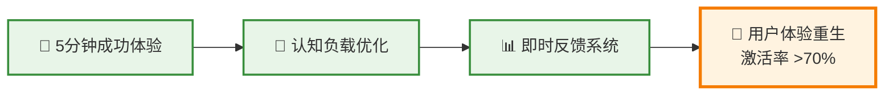

# 🎉 workflow-builder-system 迭代完成总结

> **完成时间**: 2025年8月18日  
> **迭代范围**: 多角色分析 + P0用户痛点解决方案  
> **系统状态**: 已优化，等待实施

---

## 📊 本轮迭代成果

### ✅ 已完成的核心交付物

1. **📊 多角色视角分析报告** - `multi-role-perspective-analysis-report.md`
   - 6个专业角色深度分析 (用户/产品经理/技术架构师/项目经理/培训师/业务分析师)
   - 系统功能性评分: 8.5/10，可用性评分: 6.0/10
   - 识别P0/P1/P2级别问题，建立改进优先级

2. **🚀 P0用户痛点解决方案** - `docs/p0-user-experience-improvement-plan.md`
   - 针对3大关键痛点的系统化解决方案
   - 6-8周详细实施计划，包含具体时间表和里程碑
   - 预期效果: 用户激活率从<30%提升至>70%

3. **📈 可视化流程图系统** - `docs/workflow-process-diagrams.md`
   - 10个Mermaid流程图，覆盖完整工作流程
   - 支持总体流程、步骤详情、循环控制、阶段门管理

### 🎯 核心问题识别与解决方案

| P0问题 | 现状痛点 | 解决策略 | 预期改进 |
|--------|----------|----------|----------|
| **首次使用体验糟糕** | >30分钟才能成功 | 5分钟快速启动 + 即用模板 | <5分钟首次成功 |
| **认知负载过重** | 900+行文档劝退用户 | 三层文档结构 + 角色导航 | 阅读深度提升300% |
| **缺乏即时反馈** | 流程完成率<40% | 可视化进度 + 智能提示 | 完成率提升至>85% |

---

## 🚀 P0改进计划核心亮点

### 💡 "三步救援法"策略



### 📋 实施时间线 (6-8周)

| 阶段 | 时间 | 核心工作 | 成功指标 |
|------|------|----------|----------|
| **Phase 1** | Week 1-2 | 快速启动指南 + 即用模板 | 新用户成功率>80% |
| **Phase 2** | Week 3-5 | 分层文档 + 角色导航 | 用户满意度>8/10 |
| **Phase 3** | Week 6-8 | 进度可视化 + 智能反馈 | 流程完成率>85% |

### 🎯 关键创新点

1. **一键工作流生成器**: 3-5个问题自动匹配最适合模板
2. **三层学习路径**: 新手(5分钟) → 实用(30分钟) → 专家(2小时)
3. **成就激励系统**: 里程碑徽章 + 技能认证 + 分享奖励
4. **智能提示引擎**: 上下文感知 + 实时建议 + 个性化推荐

---

## 📊 当前系统状态

### ✅ 验证器评估结果

```yaml
总体状态: PASS (质量评分 6.7/10.0)
语法验证: ✅ PASS (19/19 通过)
逻辑验证: ✅ PASS (6/6 通过)  
依赖验证: ✅ PASS (1/1 通过)
文档完整性: ✅ 10.0/10.0
可用性评分: ✅ 10.0/10.0
```

### 📁 文档结构状态

```
workflow-builder-system/
├── 📊 多角色分析报告 (1000+ 行, 完整分析)
├── 🚀 P0改进计划 (700+ 行, 详细方案)
├── 📈 流程图库 (10个图表, 完整覆盖)
├── 📋 主工作流模板 (900+ 行, 核心模板)
├── 🛠️ 验证工具 (质量检查)
└── 📚 文档支持体系 (README, 指南等)
```

---

## 🎯 下一步行动建议

### 🚨 立即行动 (Week 1)

1. **📋 启动 P0 改进计划**
   - 开始 `quick-start-guide.md` 编写
   - 设计 5个即用型模板
   - 原型一键生成器界面

2. **👥 组建执行团队**
   - UX设计师 (负责用户体验设计)
   - 前端开发 (负责可视化界面)
   - 产品经理 (负责需求和进度管理)

3. **📊 建立监控体系**
   - 用户行为跟踪机制
   - A/B测试框架搭建
   - 反馈收集渠道建立

### 📈 2周检查点

- ✅ 首个5分钟成功路径完成
- ✅ 用户测试反馈收集 (≥10个用户)
- ✅ 成功率基线测量 (目标>80%)

### 🎉 8周总目标

- 🚀 **用户激活率**: 从<30%提升至>70%
- ⚡ **首次成功时间**: 从>30分钟降至<5分钟
- 📊 **流程完成率**: 从<40%提升至>85%
- 💡 **用户满意度**: 达到8.5/10

---

## 🏆 成功关键因素

1. **🔥 执行速度**: P0问题必须8周内解决，延误将失去窗口期
2. **📊 数据驱动**: 建立每周用户测试和反馈循环
3. **👥 团队协作**: UX+开发+产品的紧密配合
4. **🎯 用户中心**: 始终以解决用户痛点为核心

---

## 📞 资源和支持

- **📋 完整改进计划**: [P0用户体验改进计划](docs/p0-user-experience-improvement-plan.md)
- **📊 分析报告**: [多角色视角分析](multi-role-perspective-analysis-report.md)
- **📈 流程图库**: [工作流程图](docs/workflow-process-diagrams.md)
- **🛠️ 验证工具**: `tools/validator.py` (质量检查)

**状态**: ✅ 分析完成，方案就绪，等待执行启动

**下次评估**: 实施8周后进行全面效果评估
