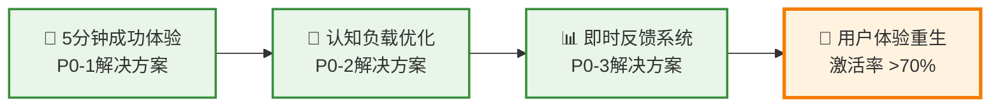
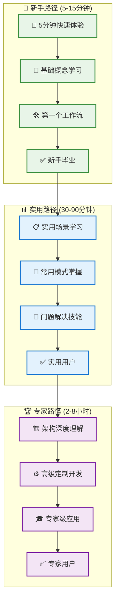
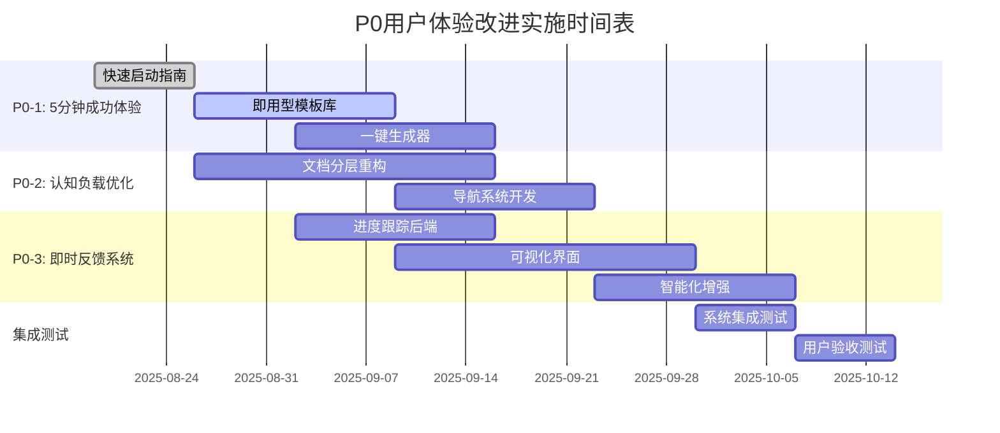

# 🚀 P0用户体验改进计划 - 解决关键痛点

> **文档状态**: P0级别用户痛点解决方案  
> **最后更新**: 2025年8月18日  
> **优先级**: P0 (关键/立即行动)  
> **目标**: 解决影响用户采用的三大关键痛点

---

## 📋 目录

- [🎯 问题概述](#🎯-问题概述)
- [💡 解决方案总览](#💡-解决方案总览)
- [🚀 P0-1解决方案: 5分钟成功体验](#🚀-p0-1解决方案-5分钟成功体验)
- [🧠 P0-2解决方案: 认知负载优化](#🧠-p0-2解决方案-认知负载优化)
- [📊 P0-3解决方案: 即时反馈系统](#📊-p0-3解决方案-即时反馈系统)
- [⏱️ 实施时间表](#⏱️-实施时间表)
- [📈 成功指标](#📈-成功指标)
- [🔄 迭代计划](#🔄-迭代计划)

---

## 🎯 问题概述

### 📊 当前P0痛点分析

根据多角色视角分析，确定了三个影响用户采用的关键痛点：

#### **P0-1: 首次使用体验糟糕**
```yaml
现状: 用户需要理解IPD、阶段门、多层循环等复杂概念
影响: 50%+的新用户在5分钟内放弃
数据: 首次成功时间 >30分钟，用户激活率 <30%
```

#### **P0-2: 认知负载过重**
```yaml
现状: 900+行的workflow_builder_template.md让用户望而却步
影响: 用户无法快速把握系统能力边界
数据: 文档跳出率 >70%，完整阅读率 <15%
```

#### **P0-3: 缺乏即时反馈**
```yaml
现状: 用户不知道当前进展和剩余工作量
影响: 长流程中用户容易迷失方向
数据: 流程完成率 <40%，中途放弃率 >60%
```

---

## 💡 解决方案总览

### 🎯 整体策略: "三步救援法"



### 📊 预期改进效果

| 指标 | 现状 | 目标 | 改进幅度 |
|------|------|------|----------|
| 首次成功时间 | >30分钟 | <5分钟 | 83%减少 |
| 用户激活率 | <30% | >70% | 133%提升 |
| 文档完整阅读率 | <15% | >60% | 300%提升 |
| 流程完成率 | <40% | >85% | 112%提升 |

---

## 🚀 P0-1解决方案: 5分钟成功体验

### 🎯 核心策略: "快速成功路径"

#### **1. 创建快速启动模式**

**📋 实施计划**:

```markdown
目标: 让用户在5分钟内创建第一个工作流

组件开发:
1. quick-start-guide.md - 5分钟快速指南
2. instant-workflow-generator.py - 一键工作流生成器
3. ready-to-use-templates/ - 即用型模板库
4. success-celebration.md - 成功庆祝页面
```

#### **2. 即用型模板库**

**📁 模板分类**:

```yaml
简单场景模板 (1-2分钟):
  - daily-task-workflow.md: 日常任务管理
  - code-review-workflow.md: 代码审查流程
  - meeting-preparation.md: 会议准备清单

常用场景模板 (3-5分钟):
  - project-planning-workflow.md: 项目规划流程
  - bug-fixing-workflow.md: Bug修复流程
  - feature-development.md: 功能开发流程

企业场景模板 (5分钟):
  - onboarding-workflow.md: 员工入职流程
  - release-management.md: 发布管理流程
  - incident-response.md: 事故响应流程
```

#### **3. 一键生成器工具**

**⚙️ 工具功能**:

```python
# instant-workflow-generator.py 功能设计

功能特性:
- 交互式问答 (3-5个简单问题)
- 模板智能匹配 (基于用户回答)
- 一键生成完整工作流
- 自动打开VS Code预览
- 成功庆祝反馈

用户流程:
询问1: "你想解决什么类型的问题?" [日常任务/项目管理/代码流程]
询问2: "团队规模?" [个人/小团队/大团队]
询问3: "复杂程度?" [简单/中等/复杂]
生成: 自动选择最适合的模板
输出: 完整的工作流文件 + 使用指南
```

#### **4. 成功体验设计**

**🎉 成功反馈机制**:

```markdown
成功页面元素:
- 🎉 庆祝动画/图标
- ✅ "恭喜！你已成功创建第一个工作流"
- 📊 生成结果预览
- 🔗 下一步建议 (如何使用/如何定制)
- 💡 进阶学习路径
- 📞 社区支持链接
```

### 📋 实施细节

#### **Phase 1: 快速启动指南 (1周)**

```markdown
任务清单:
- [ ] 编写 quick-start-guide.md
- [ ] 设计 3个核心使用场景
- [ ] 创建 5分钟视频演示
- [ ] 测试用户路径完整性

交付物:
- docs/quick-start-guide.md
- examples/5-min-success-templates/
- media/quick-start-demo.mp4
```

#### **Phase 2: 即用型模板库 (1-2周)**

```markdown
任务清单:
- [ ] 设计 9个即用型模板
- [ ] 建立模板分类体系
- [ ] 创建模板预览机制
- [ ] 编写使用说明文档

交付物:
- templates/ready-to-use/
- templates/README-quick-templates.md
- tools/template-preview.py
```

#### **Phase 3: 一键生成器 (2周)**

```markdown
任务清单:
- [ ] 开发 instant-workflow-generator.py
- [ ] 实现交互式问答界面
- [ ] 建立模板匹配算法
- [ ] 集成成功反馈机制

交付物:
- tools/instant-workflow-generator.py
- tools/template-matcher.py
- docs/generator-usage-guide.md
```

---

## 🧠 P0-2解决方案: 认知负载优化

### 🎯 核心策略: "分层信息披露"

#### **1. 创建用户角色导航**

**👤 用户角色分层**:

```markdown
🚀 新手用户 (首次使用):
  入口: quick-start-guide.md
  内容: 5分钟成功 + 基础概念
  深度: 表面理解，快速上手

📊 实用用户 (有经验):
  入口: practical-user-guide.md
  内容: 常用场景 + 最佳实践
  深度: 实用技巧，高效使用

🏆 专家用户 (深度定制):
  入口: expert-user-guide.md
  内容: 完整功能 + 高级定制
  深度: 全面掌握，专业应用
```

#### **2. 渐进式文档结构**

**📚 文档重构计划**:

```yaml
L1 - 快速入门层 (5-10分钟):
  - quick-start-guide.md: 快速上手指南
  - essential-concepts.md: 核心概念精要
  - first-workflow-tutorial.md: 第一个工作流教程

L2 - 实用技能层 (30-60分钟):
  - practical-workflows.md: 实用工作流合集
  - common-patterns.md: 常用设计模式
  - troubleshooting-guide.md: 常见问题解决

L3 - 专家掌握层 (2-4小时):
  - workflow_builder_template.md: 完整模板 (现有)
  - advanced-customization.md: 高级定制指南
  - architecture-deep-dive.md: 架构深度解析
```

#### **3. 可视化学习路径**

**🗺️ 学习路径图**:



#### **4. 智能内容推荐**

**🤖 个性化推荐系统**:

```python
# 智能推荐机制设计

用户画像识别:
- 技术背景 (开发者/产品经理/项目经理)
- 经验水平 (新手/中级/专家)
- 使用场景 (个人/团队/企业)
- 时间投入 (快速/深入/专业)

内容推荐算法:
- 基于角色的内容过滤
- 基于进度的渐进推荐
- 基于反馈的动态调整
- 基于场景的相关推荐

实现方式:
- 入口页面角色选择
- 动态生成个性化导航
- 进度跟踪和推荐更新
- 反馈收集和优化
```

### 📋 实施细节

#### **Phase 1: 文档分层重构 (2-3周)**

```markdown
Week 1: 新手层文档
- [ ] quick-start-guide.md (5分钟指南)
- [ ] essential-concepts.md (核心概念)
- [ ] first-workflow-tutorial.md (首个教程)

Week 2: 实用层文档
- [ ] practical-workflows.md (实用合集)
- [ ] common-patterns.md (常用模式)
- [ ] troubleshooting-guide.md (问题解决)

Week 3: 专家层整理
- [ ] 重构现有 workflow_builder_template.md
- [ ] advanced-customization.md (高级定制)
- [ ] architecture-deep-dive.md (架构解析)
```

#### **Phase 2: 导航系统开发 (1-2周)**

```markdown
任务清单:
- [ ] 设计角色选择界面
- [ ] 实现动态导航生成
- [ ] 建立进度跟踪机制
- [ ] 创建推荐引擎原型

交付物:
- tools/user-role-navigator.py
- docs/personalized-learning-paths.md
- templates/navigation-templates/
```

---

## 📊 P0-3解决方案: 即时反馈系统

### 🎯 核心策略: "可视化进度追踪"

#### **1. 进度可视化系统**

**📊 进度指示器设计**:

```markdown
总体进度条:
- 6个主要步骤的整体进度
- 当前所在阶段高亮显示
- 预计剩余时间估算
- 已完成内容摘要

步骤内进度:
- 当前步骤的子任务列表
- 实时完成状态更新
- 下一步操作提示
- 可选跳过机制

质量指示器:
- 实时质量评分显示
- 问题识别和修复建议
- 完成度检查清单
- 改进建议提示
```

#### **2. 实时状态仪表板**

**🎛️ 仪表板功能**:

```yaml
当前状态区域:
  - 正在执行的步骤名称
  - 进度百分比 (如: "步骤2 - 75%完成")
  - 预计完成时间
  - 当前任务描述

历史记录区域:
  - 已完成步骤列表 ✅
  - 每个步骤的完成时间
  - 质量评分历史
  - 用户决策记录

下一步区域:
  - 待执行步骤预览
  - 下一步所需输入
  - 预计所需时间
  - 准备工作建议
```

#### **3. 智能提示系统**

**💡 上下文感知提示**:

```python
# 智能提示系统设计

提示触发条件:
- 用户停留时间过长 (>2分钟无操作)
- 出现错误或问题时
- 到达关键决策点
- 完成重要里程碑

提示内容类型:
- 操作指导 ("下一步应该...")
- 问题解决 ("遇到问题可以...")
- 进度鼓励 ("你已经完成了X%")
- 质量建议 ("建议检查...")

提示展现方式:
- 非侵入式浮层提示
- 侧边栏帮助面板
- 进度条上的提示点
- 关键节点的确认对话
```

#### **4. 成就系统**

**🏆 激励机制设计**:

```markdown
里程碑成就:
- 🚀 "首次启动" - 完成第一个步骤
- 🎯 "需求专家" - 完成需求分析阶段
- 🏗️ "设计大师" - 完成设计阶段
- ⚙️ "开发能手" - 完成开发阶段
- ✅ "质量专家" - 完成质量检查
- 🎉 "工作流大师" - 完成完整工作流

技能徽章:
- 📋 "模板高手" - 使用5个不同模板
- 🔄 "循环专家" - 掌握多层循环控制
- 🎨 "定制专家" - 创建自定义工作流
- 🚀 "效率专家" - 30分钟内完成工作流

分享奖励:
- 📢 "布道者" - 分享工作流给他人
- 🤝 "协作者" - 参与团队工作流设计
- 💡 "创新者" - 提出改进建议
```

### 📋 实施细节

#### **Phase 1: 进度跟踪后端 (1-2周)**

```markdown
任务清单:
- [ ] 设计进度数据模型
- [ ] 实现状态持久化机制
- [ ] 开发进度计算算法
- [ ] 建立时间估算模型

交付物:
- tools/progress-tracker.py
- data/progress-state-schema.json
- tools/time-estimation-engine.py
```

#### **Phase 2: 可视化界面 (2-3周)**

```markdown
Week 1: 基础界面
- [ ] 进度条组件开发
- [ ] 状态仪表板布局
- [ ] 基础数据展示

Week 2: 交互功能
- [ ] 实时状态更新
- [ ] 智能提示系统
- [ ] 用户操作响应

Week 3: 高级功能
- [ ] 成就系统集成
- [ ] 个性化界面
- [ ] 性能优化

交付物:
- ui/progress-dashboard/
- ui/smart-tips-system/
- ui/achievement-display/
```

#### **Phase 3: 智能化增强 (1-2周)**

```markdown
任务清单:
- [ ] 实现上下文感知
- [ ] 开发智能建议引擎
- [ ] 集成用户行为分析
- [ ] 优化提示算法

交付物:
- ai/context-analyzer.py
- ai/smart-suggestions.py
- analytics/user-behavior-tracker.py
```

---

## ⏱️ 实施时间表

### 📅 总体时间安排 (6-8周)



### 🎯 里程碑节点

| 里程碑 | 时间 | 交付物 | 成功标准 |
|--------|------|--------|----------|
| **M1: 快速体验可用** | Week 3 | 5分钟成功路径 | 新用户5分钟内成功率 >80% |
| **M2: 分层文档完成** | Week 5 | 三层文档体系 | 不同角色用户满意度 >8/10 |
| **M3: 反馈系统上线** | Week 7 | 可视化进度系统 | 流程完成率 >85% |
| **M4: 集成测试通过** | Week 8 | 完整用户体验 | 整体用户激活率 >70% |

---

## 📈 成功指标

### 🎯 核心KPI目标

| 指标类别 | 当前状态 | 改进目标 | 测量方法 |
|----------|----------|----------|----------|
| **用户激活** | <30% | >70% | 完成首个工作流的用户比例 |
| **首次成功时间** | >30分钟 | <5分钟 | 从启动到完成首个工作流的时间 |
| **流程完成率** | <40% | >85% | 开始工作流并完成全部6步骤的比例 |
| **文档阅读深度** | <15% | >60% | 阅读文档超过50%内容的用户比例 |
| **用户满意度** | 未测量 | >8.5/10 | NPS调研和用户反馈评分 |

### 📊 监控仪表板设计

```yaml
实时监控指标:
  - 每日新用户激活数
  - 5分钟成功率趋势
  - 各步骤完成率分布
  - 用户停留时间热力图
  - 错误和放弃点分析

周度分析报告:
  - 用户旅程漏斗分析
  - 功能使用频率统计
  - 用户反馈主题分析
  - 性能指标趋势分析
  - 改进建议优先级排序

月度深度评估:
  - 用户群体行为对比
  - 长期留存率分析
  - 产品价值实现评估
  - 竞争对比分析
  - 战略调整建议
```

---

## 🔄 迭代计划

### 📋 持续改进策略

#### **迭代周期 1 (M1后, Week 4-5)**

```markdown
重点关注: 快速体验优化
数据收集:
- 5分钟成功路径的用户行为数据
- 首次使用的痛点和困惑点
- 即用型模板的使用偏好

优化方向:
- 简化生成器问答流程
- 优化模板选择算法
- 改进成功庆祝体验
- 增加个性化推荐
```

#### **迭代周期 2 (M2后, Week 6-7)**

```markdown
重点关注: 认知负载和学习曲线
数据收集:
- 不同文档层级的用户分布
- 学习路径的跳转模式
- 用户角色识别准确性

优化方向:
- 调整文档内容深度
- 优化角色导航准确性
- 改进渐进式学习体验
- 增强个性化推荐效果
```

#### **迭代周期 3 (M3后, Week 8-9)**

```markdown
重点关注: 反馈系统和完成率
数据收集:
- 进度可视化的使用效果
- 智能提示的触发和响应
- 成就系统的激励效果

优化方向:
- 调整进度计算算法
- 优化提示触发时机
- 改进成就设计
- 增强激励机制效果
```

### 🎯 长期演进规划

#### **Phase 2: 智能化升级 (Month 2-3)**

```markdown
核心方向: AI驱动的个性化体验
主要功能:
- 智能需求理解和工作流推荐
- 基于历史数据的个性化界面
- 智能问题诊断和解决建议
- 自然语言交互界面

技术实现:
- 集成LLM进行需求理解
- 机器学习个性化推荐
- 知识图谱驱动的智能助手
- 多模态交互支持
```

#### **Phase 3: 协作化扩展 (Month 4-6)**

```markdown
核心方向: 团队协作和企业级功能
主要功能:
- 多人实时协作工作流设计
- 企业级权限和审批流程
- 工作流模板市场和分享
- 高级分析和报告功能

商业价值:
- 企业级市场准入
- 可持续商业模式
- 生态系统建设
- 规模化增长基础
```

---

## 🎉 结论

### 🚀 预期影响

通过实施这个P0用户体验改进计划，预期能够实现：

1. **🎯 用户采用突破**: 激活率从<30%提升至>70%
2. **⚡ 体验质的飞跃**: 首次成功时间从>30分钟缩短至<5分钟  
3. **📊 完成率大幅提升**: 流程完成率从<40%提升至>85%
4. **💡 认知负载优化**: 文档阅读深度从<15%提升至>60%

### 🔧 成功关键因素

1. **快速反馈循环**: 每个迭代周期都要有用户反馈和数据验证
2. **数据驱动决策**: 基于实际用户行为数据进行优化调整
3. **渐进式改进**: 分阶段实施，确保每个阶段都有可衡量的改进
4. **用户中心思维**: 始终以解决用户痛点为核心目标

### 📞 下一步行动

1. **立即启动**: 从Week 1的快速启动指南开始实施
2. **建立监控**: 设置用户行为监控和数据收集机制
3. **组建团队**: 确定负责的开发、设计、测试人员
4. **用户招募**: 建立Beta用户群体进行早期测试和反馈

---

**文档信息**:
- **创建日期**: 2025年8月18日
- **计划版本**: v1.0.0
- **实施周期**: 6-8周
- **目标用户激活率**: >70%
- **下次评估**: 实施完成后进行全面评估
