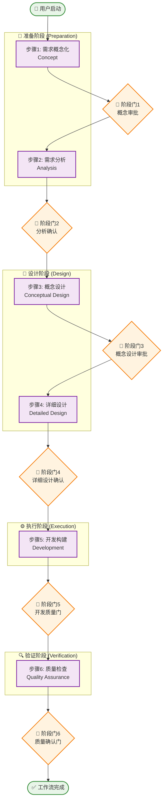
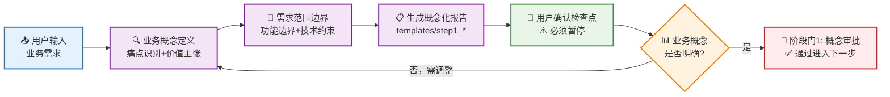
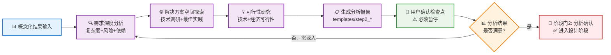
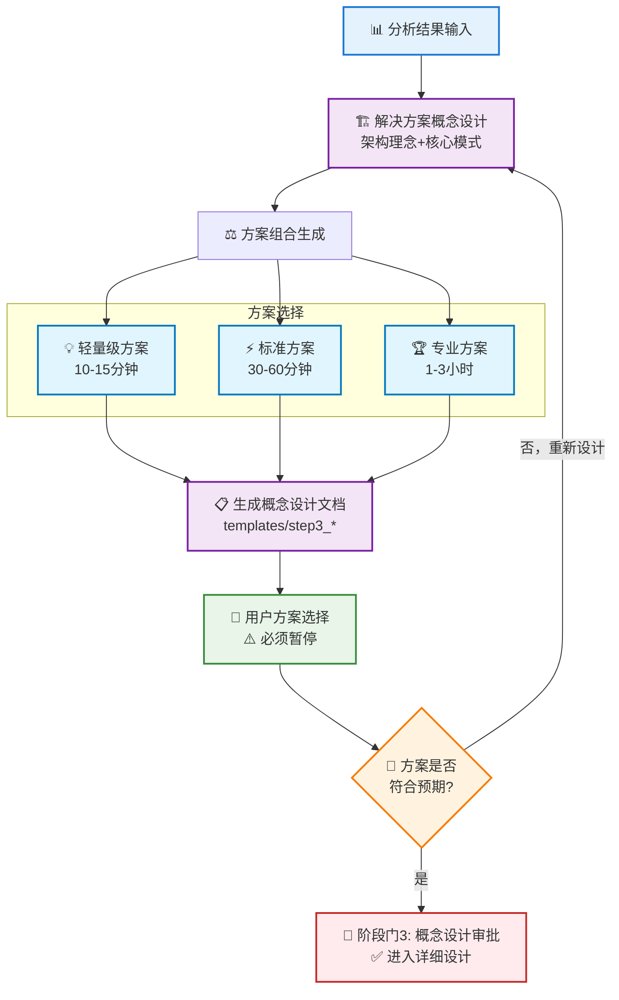
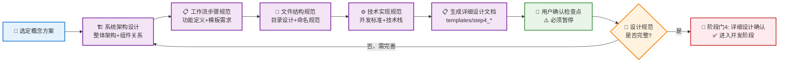
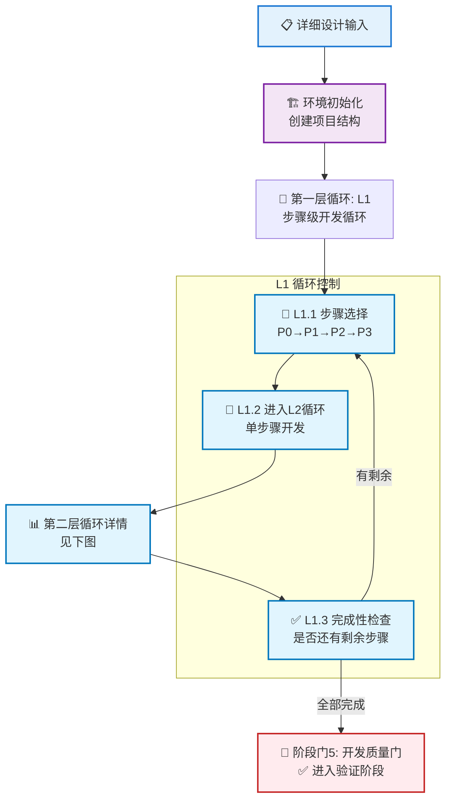
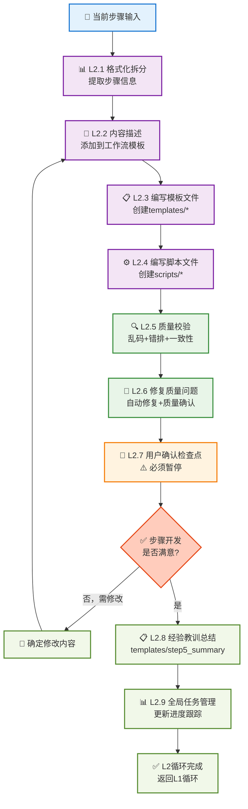
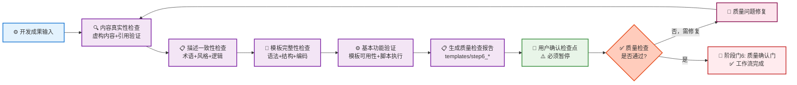
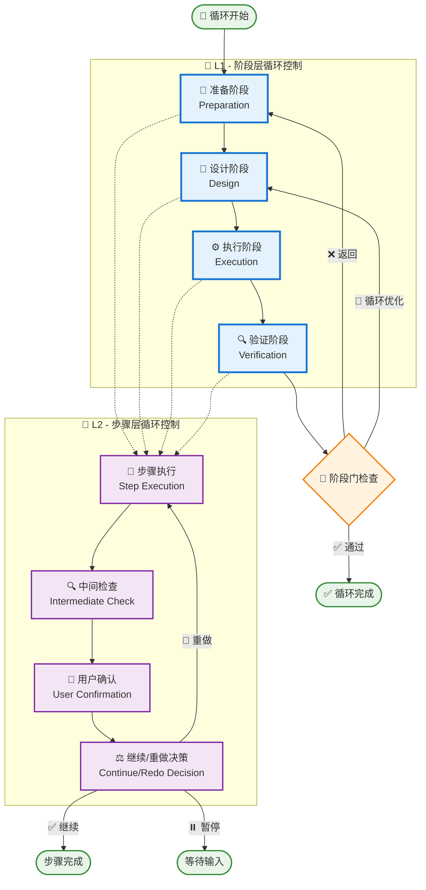
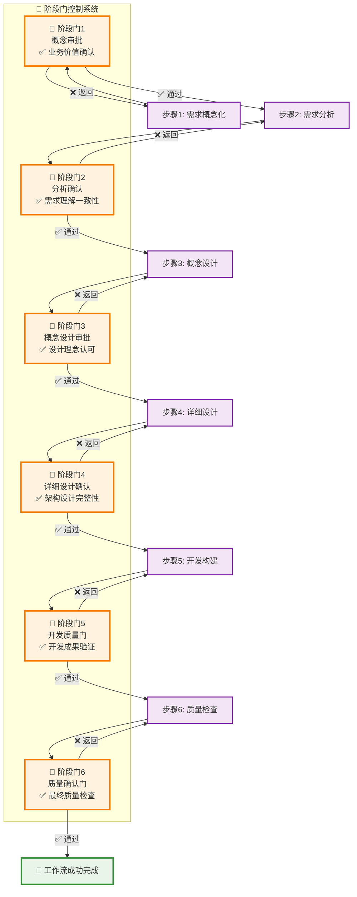

# 🏗️ 工作流构建器 - 流程可视化图表

> **文档状态**: 独立附录文件 - workflow-builder-system流程图表  
> **最后更新**: 2025年8月18日  
> **图表类型**: Mermaid流程图，支持VS Code实时预览  
> **用途**: 将IPD 6步骤工作流程可视化，提供图表化的流程指南

---

## 📑 目录

- [🎯 总体流程概览](#🎯-总体流程概览)
- [📍 准备阶段流程图](#📍-准备阶段流程图)
- [📐 设计阶段流程图](#📐-设计阶段流程图)  
- [⚙️ 执行阶段流程图](#⚙️-执行阶段流程图)
- [🔍 验证阶段流程图](#🔍-验证阶段流程图)
- [🔄 多层循环控制图](#🔄-多层循环控制图)
- [🚪 阶段门控制图](#🚪-阶段门控制图)

---

## 🎯 总体流程概览

### 📊 IPD 6步骤工作流总览

---

## 📍 准备阶段流程图

### 📊 步骤1: 需求概念化流程

### 📊 步骤2: 需求分析流程

---

## 📐 设计阶段流程图

### 📊 步骤3: 概念设计流程

### 📊 步骤4: 详细设计流程

---

## ⚙️ 执行阶段流程图

### 📊 步骤5: 开发构建总体流程

### 📊 步骤5: L2循环详细流程

---

## 🔍 验证阶段流程图

### 📊 步骤6: 质量检查流程

---

## 🔄 多层循环控制图

### 📊 L1-L2 双层循环架构

---

## 🚪 阶段门控制图

### 📊 IPD 6个阶段门控制流程

---

## 📚 使用说明

### 🎯 图表使用指导

1. **总体流程概览**: 用于快速理解整个workflow-builder-system的6个步骤结构
2. **阶段详细图表**: 用于深入了解每个步骤的具体执行流程
3. **循环控制图**: 用于理解复杂的多层循环控制机制
4. **阶段门控制**: 用于掌握IPD方法论的质量控制要点

### 🔧 VS Code预览

- 安装 `Mermaid Preview` 插件
- 使用 `Ctrl+Shift+P` → `Mermaid: Preview`
- 实时查看图表渲染效果

### 📋 图表更新

- 图表与 `workflow_builder_template.md` 保持同步
- 工作流程变更时需同步更新图表
- 建议定期检查图表的准确性

---

**文档信息**:
- **创建日期**: 2025年8月18日
- **图表版本**: v1.0.0  
- **对应工作流版本**: v2.0.0
- **图表总数**: 10个主要流程图
- **支持工具**: Mermaid.js + VS Code预览
